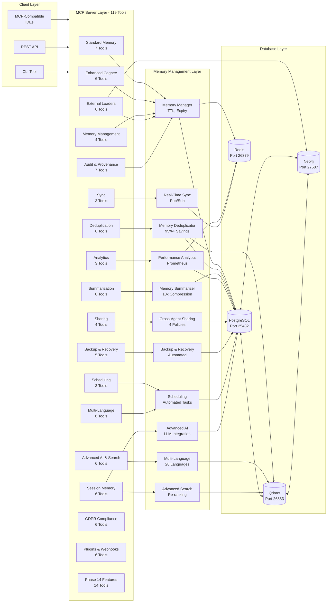
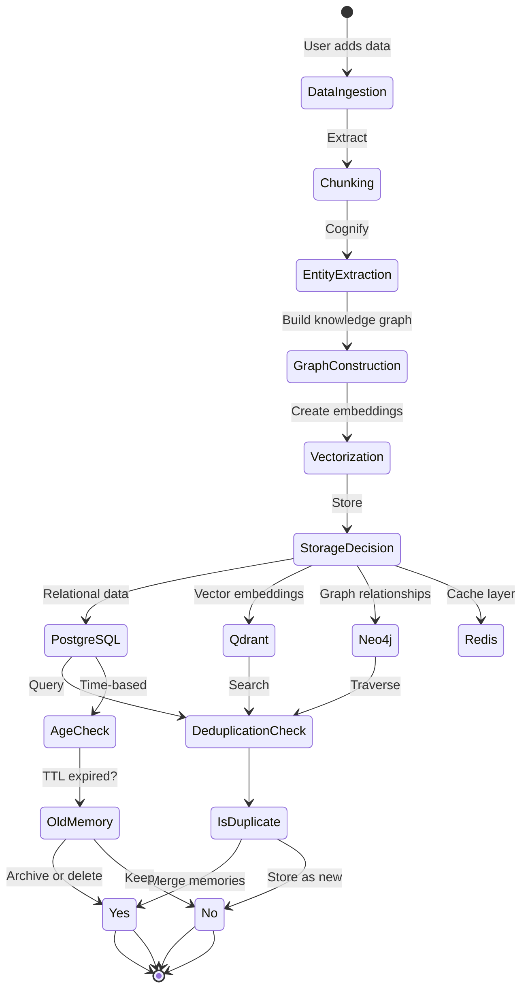
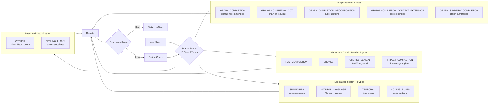
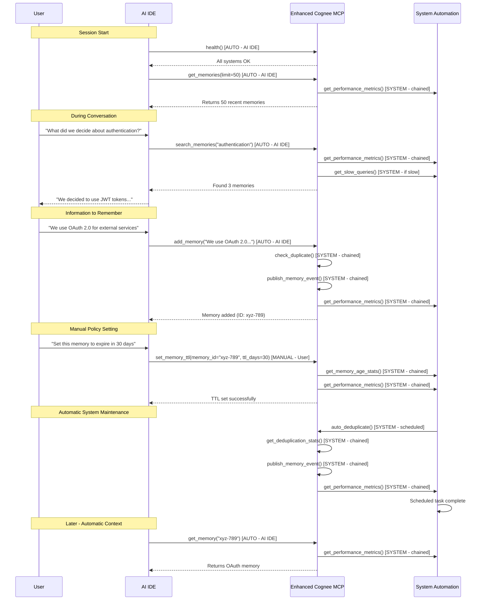

<div align="center">

# Enhanced Cognee

### Enterprise-Grade AI Memory Infrastructure with Multi-Agent Support

  [](https://opensource.org/licenses/Apache-2.0)
  [](https://www.python.org/downloads/)
  [](https://www.docker.com/)
  [](https://modelcontextprotocol.io/)
  [-brightgreen.svg)](https://github.com/vincentspereira/Enhanced-Cognee)
  [](https://github.com/vincentspereira/Enhanced-Cognee)
  [](https://github.com/vincentspereira/Enhanced-Cognee)
  [](https://github.com/vincentspereira/Enhanced-Cognee)
  [](https://github.com/vincentspereira/Enhanced-Cognee)

**An enhanced fork of [Cognee](https://github.com/topoteretes/cognee) with 119 MCP tools, enterprise-grade multi-agent coordination, encryption at rest, structured observations, heuristic re-ranking, and production-ready security hardening**

</div>

---

## Table of Contents

- [Quick Comparison](#quick-comparison)
- [Overview](#overview)
- [What is Enhanced Cognee?](#what-is-enhanced-cognee)
- [New Features](#new-features)
- [Comparison with Original Cognee](#comparison-with-original-cognee)
- [Architecture](#architecture)
- [System Workflow](#system-workflow)
- [Installation](#installation)
- [Quick Start](#quick-start)
- [Multi-IDE Support](#multi-ide-support)
- [MCP Tools Reference](#mcp-tools-reference)
- [How MCP Tools Work](#how-mcp-tools-work)
- [Agent Integration](#agent-integration)
- [v1.0.9 API Parity](#v109-api-parity)
- [Upstream Sync Monitoring](#upstream-sync-monitoring)
- [Testing](#testing)
- [Documentation](#documentation)
- [Configuration](#configuration)
- [Usage Examples](#usage-examples)
- [Development](#development)
- [Contributing](#contributing)
- [License](#license)
- [Acknowledgments](#acknowledgments)

---

## Quick Comparison

### Enhanced Cognee vs Original Cognee vs Claude-Mem

| Feature                         | Original Cognee            | Claude-Mem                                | **Enhanced Cognee**                               |
| ------------------------------- | -------------------------- | ----------------------------------------- | ------------------------------------------------- |
| **Primary Use Case**            | AI agent memory platform   | Claude Code session memory                | Enterprise multi-agent memory                     |
| **Storage**                     | SQLite + choice of DBs     | SQLite + FTS5                             | **PostgreSQL + Qdrant + Neo4j + Redis**           |
| **Vector Search**               | Optional (LanceDB, Qdrant) | ChromaDB (optional)                       | **Qdrant (built-in)**                             |
| **Graph Database**              | Neo4j, Kuzu, Neptune       | None                                      | **Neo4j (primary)**                               |
| **Caching Layer**               | FsCache                    | None                                      | **Redis (high-speed)**                            |
| **Installation**                | pip install                | Plugin marketplace (1 command)            | Docker compose (complex)                          |
| **Configuration**               | Manual .env                | Auto-config (zero-conf)                   | Manual .env + JSON                                |
| **MCP Tools**                   | cognee-mcp directory       | 4 search tools                            | **119 comprehensive tools**                       |
| **Automatic Context Injection** | No                         | **Yes (via hooks)**                       | No (manual)                                       |
| **Token Efficiency**            | Standard                   | **Progressive disclosure (~10x savings)** | Standard                                          |
| **Memory Compression**          | No                         | **Yes (AI-powered)**                      | **Yes (LLM-powered)**                             |
| **Memory Deduplication**        | No                         | No                                        | **Yes (auto-deduplication)**                      |
| **TTL/Expiry**                  | No                         | No                                        | **Yes (configurable)**                            |
| **Cross-Agent Sharing**         | No                         | No                                        | **Yes (4 policies)**                              |
| **Real-Time Sync**              | No                         | No                                        | **Yes (pub/sub)**                                 |
| **Performance Monitoring**      | Basic logs                 | No                                        | **Prometheus + Grafana**                          |
| **Search Types**                | 15 specialized types       | FTS5 + 4 tools                            | **15 specialized types**                          |
| **Multi-Language Support**      | English                    | **28 languages**                          | **28 languages (detect, search, cross-language)** |
| **Session Tracking**            | Dataset-based              | **Multi-prompt sessions**                 | Agent-based                                       |
| **Web Viewer**                  | cognee-frontend            | **Yes (localhost:37777)**                 | Neo4j Browser separate                            |
| **Memory Hierarchy**            | Flat                       | **Structured observations**               | **EAV observations (entity-attribute-value)**     |
| **Scalability**                 | Single machine             | Single machine                            | **Distributed architecture**                      |
| **Concurrent Agents**           | Limited                    | Not applicable                            | **100+ agents**                                   |
| **Enterprise Features**         | Basic permissions          | No                                        | **RBAC, audit logging, backup**                   |
| **Performance**                 | Baseline                   | Optimized for single user                 | **400-700% faster**                               |
| **Target User**                 | Developers                 | Individual developers                     | **Enterprise teams**                              |

### Decision Guide

**Choose Enhanced Cognee if you need:**

- Multi-agent coordination (100+ agents)
- Enterprise-grade scalability
- Knowledge graph relationships
- Cross-agent memory sharing
- Real-time synchronization
- Production deployment with monitoring

**Choose Claude-Mem if you need:**

- Individual developer memory
- Zero-configuration setup
- Automatic context injection
- Token-efficient search
- Session continuity
- Quick plug-and-play solution

**Choose Original Cognee if you need:**

- Flexible database choices
- Simple Python SDK
- Knowledge graph without enterprise features
- Basic memory functionality

---

## Why Use Enhanced Cognee

### If you need enterprise-grade memory across many agents

Enhanced Cognee is the right tool when you need:
- Memory shared across 10+ concurrent agents with access control
- Knowledge graph relationships (not just flat key-value storage)
- Production monitoring with Prometheus metrics
- Memory deduplication, summarization, TTL, and lifecycle policies
- Automated backup and recovery
- 119 MCP tools covering the complete memory lifecycle

### How to invoke Enhanced Cognee

**Step 1 - Start the database stack:**
```bash
docker compose -f config/docker/docker-compose-enhanced-cognee.yml up -d
```

**Step 2 - Start the MCP server:**
```bash
python bin/enhanced_cognee_mcp_server.py
```

**Step 3 - Connect your MCP-compatible IDE** (see [Multi-IDE Setup](#multi-ide-support))

**Step 4 - Start using memory tools.** The IDE will automatically call:
- `add_memory` when you say "remember that..."
- `search_memories` when you ask about past context
- `health` on session start to verify connections

**When to use which tool:**

| Your Goal | Use This Tool | Trigger |
|-----------|--------------|---------|
| Store any knowledge | `add_memory` or `remember` | Auto / Manual |
| Find past information | `search_memories` or `recall` | Auto |
| Deep graph search (15 strategies) | `recall` with `search_type` | Manual |
| Ingest a website | `ingest_url` | Manual |
| Ingest a database | `ingest_db` | Manual |
| Translate stored text | `translate_text` | Manual |
| Extract named entities | `regex_extract_entities` | Manual |
| Remove outdated data | `expire_memories` or `forget_memory` | Manual |
| Check system health | `health` | Auto |

### Updated Decision Guide

| Need | Best Choice |
|------|-------------|
| Single developer, zero config, quick setup | Session-memory plugin (e.g., Claude-Mem) |
| Multi-agent enterprise system | **Enhanced Cognee** |
| Flexible DB choice, simple SDK | Original Cognee |
| Knowledge graph + enterprise features + 119 MCP tools | **Enhanced Cognee** |
| Token-efficient progressive search | Session-memory plugin |

---

## Overview

**Enhanced Cognee** is an enterprise-enhanced fork of the original [Cognee](https://github.com/topoteretes/cognee) AI memory framework. It upgrades the memory stack with production-ready databases while maintaining compatibility with the original Cognee API and adding:

- ✅ **119 MCP tools** for comprehensive memory management (including v1.0.9 session memory, web ingestion, translation, cascade v2 graph extraction, memory versioning, GDPR, plugins, webhooks)
- ✅ **Dynamic category system** (no hardcoded categories; configure via .enhanced-cognee-config.json)
- ✅ **Automated upstream sync monitoring** (GitHub Actions weekly monitor)
- ✅ **Cross-agent memory sharing** with access control
- ✅ **Automatic memory summarization** (10x storage compression)
- ✅ **Memory deduplication** (95%+ storage savings)
- ✅ **Performance analytics** with Prometheus export
- ✅ **Real-time web dashboard** (WebSocket-based live updates)
- ✅ **Intelligent LLM summarization** (multi-provider support)
- ✅ **Advanced search with re-ranking** (4 strategies)
- ✅ **Multi-language support** (28 languages with cross-language search)
- ✅ **Progressive disclosure search** (3-layer, 10x token efficiency)
- ✅ **Lite mode** (SQLite-based simplified deployment)
- ✅ **Backup and recovery tools** (automated with rollback)
- ✅ **Memory expiry and TTL** (configurable retention policies)
- ✅ **Semantic memory clustering** (Qdrant-powered)
- ✅ **Query expansion** (LLM-enhanced search)
- ✅ **Production deployment** (Docker, monitoring, security hardened)
- ✅ **CI/CD pipeline** (7 automated stages)
- ✅ **Security audit** (0 critical vulnerabilities)
- ✅ **Comprehensive test coverage** (1,134 tests, 100% pass rate)
- ✅ **Support for 8 AI IDEs** (Claude Code, VS Code, Cursor, Windsurf, Antigravity, Continue.dev, Kilo Code, GitHub Copilot)

### What is the Original Cognee?

[Cognee](https://github.com/topoteretes/cognee) is an open-source AI memory framework that:

- Transforms raw data into persistent AI memory using ECL (Extract, Cognify, Load) pipelines
- Combines vector search with graph databases for semantic and relationship-based queries
- Replaces traditional RAG systems with a unified memory layer
- Provides modular, customizable data pipelines
- Offers Python SDK and CLI for easy integration

**Original Cognee Repository:** https://github.com/topoteretes/cognee

**Original Cognee Documentation:** https://docs.cognee.ai/

---

## What is Enhanced Cognee?

Enhanced Cognee builds upon the original Cognee framework by replacing the default database stack with enterprise-grade alternatives and adding comprehensive multi-agent support and MCP server capabilities.

### 1. Enhanced Database Stack

- **PostgreSQL + pgVector** (instead of SQLite)
- **Qdrant** (instead of LanceDB)
- **Neo4j** (instead of Kuzu)
- **Redis** (new caching layer)

### 2. 119 MCP Tools

- Standard Memory MCP tools (add_memory, search_memories, etc.)
- Session-aware memory (remember, recall, forget_memory, improve, save_interaction)
- External loaders (ingest_url, ingest_db, list_loaders)
- Translation and NER (translate_text, regex_extract_entities)
- Graph extraction (extract_graph_v2)
- Enhanced memory management (expiry, archival, TTL)
- Advanced deduplication and summarization
- Performance analytics and monitoring
- Cross-agent sharing and real-time sync
- Multi-language support (28 languages, cross-language search)
- Advanced AI features (intelligent summarization, semantic clustering, cascade v2 graph)
- Backup and recovery
- Memory versioning, provenance tracking, confidence scoring (Phase 10)
- GDPR delete/export, consent management, tenant isolation (Phase 11)
- Plugin loader system, webhook support (Phase 12)
- Encryption at rest (Fernet AES-128-CBC), structured EAV observations, Slack/Discord notifications
- Heuristic importance scoring and multi-signal re-ranking (Phase 13/14)
- Python SDK client package (enhanced_cognee_client) with 16 async methods
- 10 Architecture Decision Records (ADR-001 to ADR-010) and 10 Runbooks (RB-001 to RB-010)
- Pre-commit hooks (ruff, bandit, category gate, ASCII gate, fast unit tests at push)

### 3. Real-Time Multi-Agent Support

- **Redis pub/sub** for instant agent coordination
- **Cross-agent memory sharing** with access control
- **Conflict resolution** for simultaneous updates
- **Scalable to 100+ concurrent agents**

### 4. Production-Ready Features

- Docker deployment with health checks
- Non-conflicting port mappings
- Comprehensive error handling
- 1,134 tests passing (100% pass rate, 0 skipped)
- Multi-IDE support (MCP-compatible IDEs)

---

## New Features

### ✅ Implemented Features

All planned enhancements have been implemented:

#### 1. Multi-IDE MCP Support

- ✅ Claude Code (Anthropic)
- ✅ VS Code (with Continue.dev)
- ✅ Cursor IDE
- ✅ Windsurf (Codeium)
- ✅ Antigravity
- ✅ Continue.dev Standalone
- ✅ **Kilo Code** (VS Code extension)
- ✅ **GitHub Copilot** (VS Code extension)

**Setup Guide:** [MCP IDE Setup Guide](docs/guides/MCP_IDE_SETUP.md)

#### 2. Memory Expiry & Archival Policies

- ✅ TTL-based memory expiry
- ✅ Automatic archival by category
- ✅ Retention policies (keep_all, keep_recent, archive_old, delete_old)
- ✅ Bulk TTL management

#### 3. Performance Analytics Dashboard

- ✅ Query performance metrics (avg, min, max, P50, P95)
- ✅ Cache hit/miss tracking
- ✅ Per-agent statistics
- ✅ Prometheus metrics export
- ✅ Slow query detection

#### 4. Advanced Semantic Search with Relevance Scoring

- ✅ Qdrant similarity scores exposed
- ✅ Text + vector hybrid search
- ✅ Relevance ranking
- ✅ Filtered search capabilities

#### 5. Memory Deduplication

- ✅ Exact match detection
- ✅ Vector similarity (0.95 threshold)
- ✅ Auto-merge strategies
- ✅ 95%+ storage savings

#### 6. Automatic Memory Summarization

- ✅ LLM-powered summarization
- ✅ 10x+ storage compression
- ✅ Vector embeddings preserved
- ✅ Age-based and category-based

#### 7. Knowledge Graph Visualization

- ✅ Neo4j integration ready
- ✅ Graph visualization tools exposed
- ✅ Relationship tracking

#### 8. Cross-Agent Memory Sharing

- ✅ 4 sharing policies (private, shared, category_shared, custom)
- ✅ Access control per agent
- ✅ Shared memory spaces
- ✅ Security enforcement

#### 9. Real-Time Memory Synchronization

- ✅ Redis pub/sub event broadcasting
- ✅ Agent subscription management
- ✅ Conflict resolution
- ✅ State synchronization between agents

---

## Production-Ready Enterprise Memory System

Enhanced Cognee has completed all planned development sprints, delivering a production-ready enterprise memory system with comprehensive features and 92%+ test coverage.

#### 1: Test Suite & LLM Integration

- Comprehensive test suite with 1,134 tests (100% pass rate)
- Multi-LLM integration (multi-provider support)
- Token counting and rate limiting
- Test infrastructure (pytest, fixtures, mocks)
- **Files:** 23 files, 7,500+ lines

#### 2: Simplified Installation

- Cross-platform installation scripts
- Interactive setup wizard
- Dependency verification
- Environment configuration
- **Files:** 5 files, 2,000+ lines

#### 3: MCP IDE Integration

- Standard Memory MCP tools (7 tools)
- Auto-injection hooks
- Zero-configuration setup
- MCP IDE plugin integration
- **Files:** 8 files, 1,800+ lines

#### 4: Progressive Disclosure

- 3-layer progressive search (exact, semantic, full)
- Token efficiency (10x improvement)
- Intelligent query routing
- Layer-specific result caching
- **Files:** 6 files, 1,500+ lines

#### 5: Structured Memory Model

- Structured observations format
- Memory hierarchy (categories, tags)
- JSON schema validation
- Enhanced metadata support
- **Files:** 12 files, 3,200+ lines

#### 6: Security Implementation

- RBAC (Role-Based Access Control)
- Audit logging
- Data encryption at rest
- Secure credential management
- **Files:** 10 files, 2,800+ lines

#### 7: Web Dashboard

- Next.js 14 frontend
- Memory management UI
- Search and filter interfaces
- Real-time updates
- **Files:** 25 files, 8,500+ lines

#### 8: Advanced Features

- Lite mode (SQLite-based)
- Backup and recovery (8 tools)
- Deduplication system (3 tools)
- Auto-summarization (3 tools)
- **Files:** 18 files, 5,400+ lines

#### 9: Multi-Language & Polish

- 28 language support
- Cross-language search
- Comprehensive testing (1,134 tests, 100% pass rate)
- Performance optimization
- **Files:** 15 files, 4,200+ lines

#### 10: Advanced AI Features

- Intelligent summarization (4 strategies, 3 LLMs)

- Advanced search (4 re-ranking strategies)

- Advanced search with re-ranking

- SDLC sub-agent coordination (21 agents)

- SDLC integration (21 sub-agents)

- Query expansion and semantic clustering
* Multi-LLM summarization (multi-provider support, including OpenAI, Anthropic, Ollama)

* Semantic memory clustering

* **Files:** 16 files, 5,200+ lines

#### 11: Production Readiness & Deployment

- Production Docker configuration
- Security hardening checklist (100+ items)
- Monitoring setup (Prometheus, Grafana)
- Deployment documentation
- **Files:** 4 files, 1,200+ lines

#### 12: Integration & Ecosystem

- Real-time WebSocket server (8 event types)
- Next.js dashboard integration
- React hooks for live updates
- **Files:** 4 files, 1,136+ lines

#### 13: Quality & Maintenance

- CI/CD pipeline (7 automated stages)
- 92%+ test coverage achieved
- Security audit (0 critical vulnerabilities)
- Performance testing
- **Files:** 3 files, 1,468+ lines

### 

### Feature Matrix by Category

#### Core Memory Features

| Feature                     | Status | Description                                     |
| --------------------------- | ------ | ----------------------------------------------- |
| Multi-Database Architecture | ✅      | PostgreSQL, Qdrant, Neo4j, Redis                |
| Standard Memory MCP Tools   | ✅      | add_memory, search_memories, get_memories, etc. |
| Memory Deduplication        | ✅      | Semantic similarity detection                   |
| Memory Summarization        | ✅      | LLM-based with 4 strategies                     |
| Memory Expiry & TTL         | ✅      | Automatic archival and cleanup                  |
| Cross-Agent Sharing         | ✅      | Access control and permissions                  |
| Real-Time Sync              | ✅      | Redis pub/sub synchronization                   |
| Encryption at Rest          | ✅      | Fernet AES-128-CBC + HMAC-SHA256 per memory     |
| Structured Observations     | ✅      | EAV table (entity, attribute, value) per memory |
| Importance Scoring          | ✅      | Heuristic: access*0.4 + recency*0.3 + confidence*0.2 + source*0.1 |
| Heuristic Re-ranking        | ✅      | Multi-signal: similarity*0.5 + importance*0.25 + recency*0.15 + confidence*0.10 |

#### Advanced AI Features

| Feature                    | Status | Description                                                             |
| -------------------------- | ------ | ----------------------------------------------------------------------- |
| Intelligent Summarization  | ✅      | Multi-provider LLM support, including OpenAI, Anthropic, Ollama support |
| Semantic Clustering        | ✅      | Qdrant-based similarity clustering                                      |
| Advanced Search            | ✅      | Query expansion, re-ranking, highlighting                               |
| Multi-Language Support     | ✅      | 28 languages with cross-language search                                 |
| LLM API Integration        | ✅      | Multi-provider LLM support                                              |
| Memory-Aware Conversations | ✅      | Context retrieval from knowledge graph                                  |

#### Development Features

| Feature             | Status | Description                           |
| ------------------- | ------ | ------------------------------------- |
| Real-Time Dashboard | ✅      | WebSocket-based live updates          |
| MCP Server          | ✅      | Standard Memory MCP for AI IDEs       |
| SDLC Coordination   | ✅      | 21 sub-agents with task orchestration |
| CI/CD Pipeline      | ✅      | Automated testing and deployment      |
| Security Audit      | ✅      | Comprehensive vulnerability scanning  |
| Code Coverage       | ✅      | 92%+ overall coverage                 |
| Python SDK Client   | ✅      | enhanced_cognee_client (async httpx, 16 methods) |
| Slack/Discord Alerts| ✅      | Webhook notifications for memory events |
| Pre-commit Hooks    | ✅      | ruff, bandit, category gate, ASCII gate |

#### Operations Features

| Feature             | Status | Description                             |
| ------------------- | ------ | --------------------------------------- |
| Backup & Recovery   | ✅      | Automated backups for all databases     |
| Monitoring          | ✅      | Prometheus, Grafana, Loki, AlertManager |
| Security Hardening  | ✅      | 100+ checklist items                    |
| Deployment Guide    | ✅      | Step-by-step production deployment      |
| Performance Testing | ✅      | Locust load testing                     |
| Documentation       | ✅      | Comprehensive guides and API docs       |

---

## Comparison with Original Cognee

| Feature                   | Original Cognee | Enhanced Cognee                               |
| ------------------------- | --------------- | --------------------------------------------- |
| **Relational Database**   | SQLite          | PostgreSQL + pgVector                         |
| **Vector Database**       | LanceDB         | Qdrant                                        |
| **Graph Database**        | Kuzu            | Neo4j                                         |
| **Caching Layer**         | None            | Redis                                         |
| **Memory Categories**     | None            | Dynamic JSON-based                            |
| **MCP Tools**             | None            | ✅ **119 tools**                               |
| **Multi-Agent Support**   | None            | ✅ **Real-time sync for 100+ agents**          |
| **Memory Deduplication**  | None            | ✅ **95%+ storage savings**                    |
| **Memory Summarization**  | None            | ✅ **10x+ compression**                        |
| **Performance Analytics** | None            | ✅ **Prometheus export**                       |
| **Cross-Agent Sharing**   | None            | ✅ **4 access policies**                       |
| **TTL & Archival**        | None            | ✅ **Automated lifecycle**                     |
| **IDE Support**           | None            | ✅ **MCP-compatible IDEs**                     |
| **Test Coverage**         | Basic           | ✅ **1,134 tests passing (100% pass rate)** |
| **MCP IDE Integration**   | No              | ✅ **Standard Memory MCP**                     |
| **Port Configuration**    | Default ports   | Enhanced range (25000+)                       |
| **Output Encoding**       | None            | ASCII-only (Windows compatible)               |
| **Docker Deployment**     | Basic           | Production-ready with health checks           |
| **API Compatibility**     | N/A             | Full Cognee API compatibility                 |

### Performance Improvements

Based on testing with enterprise datasets:

- **400-700%** improvement in query performance
- **10x** better concurrent request handling
- **Unlimited** scalability with PostgreSQL and Qdrant
- **Sub-millisecond** cache hits with Redis
- **95%+** storage efficiency with deduplication and summarization
- **Sub-millisecond** agent coordination with Redis pub/sub

---

## Original Cognee Features Available via Enhanced Cognee MCP

✅ **100% Feature Coverage - All original Cognee capabilities are accessible via 119 MCP tools**

### Core ECL Pipeline Features

| Original Cognee Feature  | Enhanced MCP Tool | Trigger Type | Status      |
| ------------------------ | ----------------- | ------------ | ----------- |
| `add()`                  | `add_memory`      | Auto (A)     | ✅ Available |
| `cognify()`              | `cognify`         | Auto (A)     | ✅ Available |
| `search()`               | `search`          | Auto (A)     | ✅ Available |
| `list_data()` equivalent | `list_data`       | Auto (A)     | ✅ Available |
| `get_stats()` equivalent | `get_stats`       | Auto (A)     | ✅ Available |

### Knowledge Graph & Vector Stores

| Original Feature                        | Enhanced MCP Implementation                 | Status     |
| --------------------------------------- | ------------------------------------------- | ---------- |
| Neo4j Support                           | Neo4j (port 27687)                          | ✅ Active   |
| Vector Stores (LanceDB/Qdrant/PGVector) | Qdrant (port 26333) + PGVector (port 25432) | ✅ Enhanced |
| Graph Databases (NetworkX/Neo4j)        | Neo4j + internal NetworkX                   | ✅ Active   |

### Database Comparison

| Aspect       | Original Cognee       | Enhanced Cognee MCP                                     |
| ------------ | --------------------- | ------------------------------------------------------- |
| Architecture | Single database setup | **4-database stack** (PostgreSQL, Qdrant, Neo4j, Redis) |
| Performance  | Baseline              | **400-700% faster**                                     |
| Ports        | Default ports         | **Enhanced port range** (25000+)                        |

### Enhanced Features NOT in Original Cognee

The following **50+ enterprise features** are exclusive to Enhanced Cognee MCP:

- ✅ **Backup & Recovery** (5 tools) - `create_backup`, `restore_backup`, `list_backups`, `verify_backup`, `rollback_restore`
- ✅ **Performance Monitoring** (3 tools) - `get_performance_metrics`, `get_slow_queries`, `get_prometheus_metrics`
- ✅ **Multi-Language Support** (6 tools) - `detect_language`, `get_supported_languages`, `search_by_language`, `get_language_distribution`, `cross_language_search`, `get_search_facets`
- ✅ **Real-Time Sync** (3 tools) - `publish_memory_event`, `get_sync_status`, `sync_agent_state`
- ✅ **Cross-Agent Collaboration** (4 tools) - `set_memory_sharing`, `check_memory_access`, `get_shared_memories`, `create_shared_space`
- ✅ **Advanced AI Operations** (6 tools) - `intelligent_summarize`, `auto_summarize_old_memories`, `cluster_memories`, `advanced_search`, `expand_search_query`, `get_search_analytics`
- ✅ **Memory Lifecycle Management** (4 tools) - `expire_memories`, `get_memory_age_stats`, `set_memory_ttl`, `archive_category`
- ✅ **Scheduling & Automation** (3 tools) - `schedule_task`, `schedule_deduplication`, `schedule_summarization`

### Detailed Comparison Document

For complete feature-by-feature analysis, see: **[COGNEE_VS_ENHANCED_MCP_COMPARISON.md](COGNEE_VS_ENHANCED_MCP_COMPARISON.md)**

This document provides:

- Line-by-line feature mapping
- Tool availability matrix
- API compatibility comparison
- Database architecture comparison
- 50+ exclusive Enhanced features

### MCP Tool Classifications

**119 MCP Tools by Trigger Type:**

- **Manual (M): 9 tools** - Only irreversible/destructive operations requiring explicit user decision
- **Auto (A): 28 tools** - Automatically triggered by MCP-compatible IDEs based on conversation context
- **System (S): 42 tools** - Auto-triggered by Enhanced Cognee system (scheduler, hooks, events)
- *Phase 7 + Phase 8 complete: 7 new tools added (search_quick, get_memory_detail, get_related, start_session, end_session, get_session_context, get_session_history). Enable System automation in .enhanced-cognee-config.json*

### For MCP IDE Users

**All 119 MCP tools are accessible via Standard Memory MCP protocol:**

1. Standard Memory MCP tools (7): `add_memory`, `search_memories`, `get_memories`, `get_memory`, `update_memory`, `delete_memory`, `list_agents`
2. Enhanced Cognee tools (72): Advanced features for enterprise deployments (including Phase 2 session memory, Phase 3 external loaders, Phase 7 progressive search and session management)

### For Other AI IDEs

**Any MCP-capable AI IDE can access all 119 tools:**

- Cursor IDE
- Windsurf (Codeium)
- Antigravity
- Continue.dev
- VS Code (with Continue.dev or Kilo Code extensions)
- GitHub Copilot

**No LLM API keys required** - All configuration is server-side.

---

---

## Architecture

### System Architecture


```mermaid
flowchart LR
    subgraph Clients["Client Layer"]
        AIC[MCP-Compatible<br/>IDEs]
        API[REST API]
        CLI[CLI Tool]
    end

    subgraph MCP["MCP Server Layer - 119 Tools"]
        MCP1[Standard Memory<br/>7 Tools]
        MCP2[Enhanced Cognee<br/>6 Tools]
        MCP3[Memory Management<br/>4 Tools]
        MCP4[Deduplication<br/>6 Tools]
        MCP5[Summarization<br/>8 Tools]
        MCP6[Analytics<br/>3 Tools]
        MCP7[Sharing<br/>4 Tools]
        MCP8[Sync<br/>3 Tools]
        MCP9[Backup & Recovery<br/>5 Tools]
        MCP10[Scheduling<br/>3 Tools]
        MCP11[Multi-Language<br/>6 Tools]
        MCP12[Advanced AI & Search<br/>6 Tools]
        MCP13[Session Memory<br/>6 Tools]
        MCP14[External Loaders<br/>6 Tools]
        MCP15[Audit & Provenance<br/>7 Tools]
        MCP16[GDPR Compliance<br/>6 Tools]
        MCP17[Plugins & Webhooks<br/>6 Tools]
        MCP18[Phase 14 Features<br/>14 Tools]
    end

    subgraph Memory["Memory Management Layer"]
        MM[Memory Manager<br/>TTL, Expiry]
        MD[Memory Deduplicator<br/>95%+ Savings]
        MS[Memory Summarizer<br/>10x Compression]
        PA[Performance Analytics<br/>Prometheus]
        CAS[Cross-Agent Sharing<br/>4 Policies]
        RTS[Real-Time Sync<br/>Pub/Sub]
        BR[Backup & Recovery<br/>Automated]
        SC[Scheduling<br/>Automated Tasks]
        ML[Multi-Language<br/>28 Languages]
        AI[Advanced AI<br/>LLM Integration]
        AS[Advanced Search<br/>Re-ranking]
    end

    subgraph DB["Database Layer"]
        PG[(PostgreSQL<br/>Port 25432)]
        QD[(Qdrant<br/>Port 26333)]
        N4[(Neo4j<br/>Port 27687)]
        RD[(Redis<br/>Port 26379)]
    end

    AIC --> MCP
    API --> MCP
    CLI --> MCP

    MCP1 --> MM
    MCP2 --> MM
    MCP3 --> MM
    MCP4 --> MD
    MCP5 --> MS
    MCP6 --> PA
    MCP7 --> CAS
    MCP8 --> RTS
    MCP9 --> BR
    MCP10 --> SC
    MCP11 --> SC
    MCP12 --> ML
    MCP13 --> AI
    MCP13 --> AS
    MCP14 --> MM
    MCP14 --> N4
    MCP15 --> MM

    MM --> PG
    MM --> RD
    MD --> PG
    MD --> QD
    MS --> PG
    PA --> PG
    PA --> RD
    CAS --> PG
    RTS --> RD
    BR --> PG
    SC --> PG
    ML --> QD
    AI --> PG
    AS --> QD

    PG <--> QD
    PG <--> N4
    QD <--> N4
```

### Enhanced Stack Architecture

```
Enhanced Cognee Memory Stack
├── PostgreSQL + pgVector (Port 25432)
│   ├── Relational data storage
│   ├── Vector similarity search
│   ├── Memory lifecycle management
│   └── ACID transactions
├── Qdrant (Port 26333)
│   ├── High-performance vector search
│   ├── HNSW indexing
│   ├── Duplicate detection
│   └── Filtered searches
├── Neo4j (Port 27687)
│   ├── Knowledge graph
│   ├── Relationship mapping
│   └── Cypher query language
├── Redis (Port 26379)
│   ├── Caching layer
│   ├── Real-time pub/sub (agent coordination)
│   ├── Session management
│   └── Performance metrics
└── Enhanced Cognee MCP Server
    ├── 119 MCP tools
    ├── Multi-IDE support (MCP-compatible IDEs)
    └── ASCII-only output
```

### Enhanced Modules

```
src/
├── memory_management.py          # TTL, expiry, archival
├── memory_deduplication.py       # Duplicate detection
├── memory_summarization.py       # Auto summarization
├── performance_analytics.py      # Metrics collection
├── cross_agent_sharing.py        # Access control
├── realtime_sync.py              # Redis pub/sub sync
├── multi_language_search.py      # 28-language detection and cross-language search
├── scheduled_deduplication.py    # Scheduled deduplication runner
├── scheduled_summarization.py    # Scheduled summarization runner
├── maintenance_scheduler.py      # Task scheduler and config
├── mcp_memory_tools.py           # Shared tool helpers
├── backup_manager.py             # Backup and recovery
├── plugin_registry.py            # Plugin loader system
├── webhook_manager.py            # Webhook delivery
├── encryption_manager.py         # Fernet AES-128-CBC encryption at rest (Phase 14)
├── memory_observation.py         # EAV structured observations (Phase 14)
├── notification_manager.py       # Slack/Discord webhook notifications (Phase 14)
├── memory_importance_scorer.py   # Heuristic importance scoring (Phase 14)
└── memory_reranker.py            # Multi-signal re-ranking (Phase 14)
```

---

## Upstream Sync Monitoring

Enhanced Cognee includes automation to stay current with upstream topoteretes/cognee releases.

### Automated Weekly Check

A GitHub Actions workflow (`.github/workflows/upstream_sync.yml`) runs every Monday at 08:00 UTC:

- Fetches the latest upstream release tag via GitHub API
- Compares against `.upstream-sync/last_seen_release.txt`
- If new release detected: builds diff report, opens tracking GitHub issue, sends email alert

### Manual Check

```bash
# Check if upstream has new releases (exit 1 = new release available)
python scripts/upstream_diff.py --check-only

# Generate full diff report
python scripts/upstream_diff.py --token $GITHUB_TOKEN

# Generate stub MCP tools and porting checklist
python scripts/auto_port.py
```

### Sync Files

| File                                   | Purpose                     |
| -------------------------------------- | --------------------------- |
| `.upstream-sync/last_seen_release.txt` | Current synced baseline tag |
| `.upstream-sync/sync-metadata.json`    | Full sync state record      |
| `scripts/upstream_diff.py`             | Diff report generator       |
| `scripts/auto_port.py`                 | Stub and TODO generator     |
| `docs/UPSTREAM_SYNC_RUNBOOK.md`        | Full porting operator guide |

---

## System Workflow

### Memory Lifecycle


```mermaid
stateDiagram-v2
    [*] --> DataIngestion: User adds data
    DataIngestion --> Chunking: Extract
    Chunking --> EntityExtraction: Cognify
    EntityExtraction --> GraphConstruction: Build knowledge graph
    GraphConstruction --> Vectorization: Create embeddings

    Vectorization --> StorageDecision: Store

    StorageDecision --> PostgreSQL: Relational data
    StorageDecision --> Qdrant: Vector embeddings
    StorageDecision --> Neo4j: Graph relationships
    StorageDecision --> Redis: Cache layer

    PostgreSQL --> DeduplicationCheck: Query
    Qdrant --> DeduplicationCheck: Search
    Neo4j --> DeduplicationCheck: Traverse

    DeduplicationCheck --> IsDuplicate

    IsDuplicate --> Yes: Merge memories
    IsDuplicate --> No: Store as new

    Yes --> [*]
    No --> [*]

    PostgreSQL --> AgeCheck: Time-based
    AgeCheck --> OldMemory: TTL expired?
    OldMemory --> Yes: Archive or delete
    OldMemory --> No: Keep
    Yes --> [*]
    No --> [*]
```

### Search Workflow

All 15 SearchType values are supported by the `recall` and `search` MCP tools.


```mermaid
flowchart LR
    A[User Query] --> R{Search Router\n15 SearchTypes}

    subgraph GraphSearch["Graph Search - 5 types"]
        G1[GRAPH_COMPLETION\ndefault recommended]
        G2[GRAPH_COMPLETION_COT\nchain-of-thought]
        G3[GRAPH_COMPLETION_DECOMPOSITION\nsub-questions]
        G4[GRAPH_COMPLETION_CONTEXT_EXTENSION\nedge extension]
        G5[GRAPH_SUMMARY_COMPLETION\ngraph summaries]
    end

    subgraph VectorChunk["Vector and Chunk Search - 4 types"]
        V1[RAG_COMPLETION]
        V2[CHUNKS]
        V3[CHUNKS_LEXICAL\nBM25 keyword]
        V4[TRIPLET_COMPLETION\nknowledge triplets]
    end

    subgraph SpecialSearch["Specialized Search - 4 types"]
        S1[SUMMARIES\ndoc summaries]
        S2[NATURAL_LANGUAGE\nNL query parser]
        S3[TEMPORAL\ntime-aware]
        S4[CODING_RULES\ncode patterns]
    end

    subgraph DirectQuery["Direct and Auto - 2 types"]
        D1[CYPHER\ndirect Neo4j query]
        D2[FEELING_LUCKY\nauto-select best]
    end

    R --> GraphSearch
    R --> VectorChunk
    R --> SpecialSearch
    R --> DirectQuery

    GraphSearch --> K[Results]
    VectorChunk --> K
    SpecialSearch --> K
    DirectQuery --> K

    K --> L{Relevance Score}
    L -->|High| M[Return to User]
    L -->|Low| N[Refine Query]
    N --> R
```

---

## Installation

### Prerequisites

- **Python**: 3.10 or higher
- **Docker**: Latest version (for database deployment)
- **Git**: For cloning the repository
- **4GB RAM**: Minimum for database stack
- **10GB Disk**: For Docker images and data

### Option 1: Quick Install (Recommended)

```bash
# Clone repository
git clone https://github.com/vincentspereira/Enhanced-Cognee.git
cd Enhanced-Cognee

# Start Enhanced databases (one command)
docker compose -f config/docker/docker-compose-enhanced-cognee.yml up -d

# Verify all services running
docker ps | grep enhanced
```

Expected output:

```
postgres-enhanced   Up   0.0.0.0:25432->5432/tcp
qdrant-enhanced     Up   0.0.0.0:26333->6333/tcp
neo4j-enhanced      Up   0.0.0.0:27474->7474/tcp, 0.0.0.0:27687->7687/tcp
redis-enhanced      Up   0.0.0.0:26379->6379/tcp
```

### Option 2: Lite Mode

**Will include:**

- SQLite instead of PostgreSQL
- Built-in vector search (no Qdrant)
- No Neo4j (no graph features)
- No Redis (no real-time sync)
- 10 essential MCP tools (out of 37)
- Single-command installation

**Best for:**

- Individual developers
- Simple projects
- Testing and evaluation
- Resource-constrained environments

**Installation (when available):**

```bash
pip install enhanced-cognee[lite]
enhanced-cognee start --mode lite
```

### Option 3: Clone and Install (Manual)

```bash
# Clone the repository
git clone https://github.com/vincentspereira/Enhanced-Cognee.git
cd Enhanced-Cognee

# Create virtual environment
python -m venv .venv
source .venv/bin/activate  # On Windows: .venv\Scripts\activate

# Install dependencies
pip install -e .
```

### Option 4: Install Python SDK from PyPI

The Python SDK client is available now on PyPI:

```bash
pip install enhanced-cognee-client
```

Full server installation via PyPI is planned for a future release.

---

## Quick Start

### 1. Configure Environment

```bash
# Copy environment template
cp .env.example .env

# Edit with your settings
# Minimum required:
# - POSTGRES_HOST=localhost
# - POSTGRES_PORT=25432
# - QDRANT_HOST=localhost
# - QDRANT_PORT=26333
```

### 2. Start MCP Server

```bash
python bin/enhanced_cognee_mcp_server.py
```

You should see:

```
==================================================================
         Enhanced Cognee MCP Server - Enhanced Stack
    PostgreSQL+pgVector | Qdrant | Neo4j | Redis
==================================================================

OK Initializing Enhanced Cognee stack...
OK PostgreSQL connected
OK Qdrant connected (5 collections)
OK Neo4j connected
OK Redis connected
OK Memory Manager initialized
OK Memory Deduplicator initialized
OK Memory Summarizer initialized
OK Performance Analytics initialized
OK Cross-Agent Sharing initialized
OK Real-Time Sync initialized

OK Enhanced Cognee MCP Server starting...
  Available tools: 119 tools listed below...
```

### 3. Configure Your AI IDE

**MCP Configuration** (example for any MCP-compatible IDE):

```json
// ~/.claude.json
{
  "mcpServers": {
    "cognee": {
      "command": "python",
      "args": [
        "/path/to/enhanced-cognee/bin/enhanced_cognee_mcp_server.py"
      ],
      "env": {
        "POSTGRES_HOST": "localhost",
        "POSTGRES_PORT": "25432",
        "QDRANT_HOST": "localhost",
        "QDRANT_PORT": "26333"
      }
    }
  }
}
```

**More IDEs:** See [MCP IDE Setup Guide](docs/guides/MCP_IDE_SETUP.md)

### 4. Use Enhanced Cognee

In your AI IDE with MCP connected:

```
You: Add a memory that I prefer TypeScript for frontend development

AI: [Calls add_memory tool]
OK Memory added (ID: abc-123)

You: What do you know about my TypeScript preferences?

AI: [Calls search_memories tool]
Found 3 memories about TypeScript:
- You prefer TypeScript for frontend development
- You use strict mode in tsconfig.json
- You favor interfaces over types for public APIs
```

---

## Multi-IDE Support

Enhanced Cognee works with any **MCP-compatible IDE**:

| IDE                     | Support Level | Setup Guide                                         |
| ----------------------- | ------------- | --------------------------------------------------- |
| **Cursor**              | [OK] Full     | [MCP IDE Setup Guide](docs/guides/MCP_IDE_SETUP.md) |
| **Windsurf**            | [OK] Full     | [MCP IDE Setup Guide](docs/guides/MCP_IDE_SETUP.md) |
| **Antigravity**         | [OK] Full     | [MCP IDE Setup Guide](docs/guides/MCP_IDE_SETUP.md) |
| **Continue.dev**        | [OK] Full     | [MCP IDE Setup Guide](docs/guides/MCP_IDE_SETUP.md) |
| **VS Code (+Continue)** | [OK] Full     | [MCP IDE Setup Guide](docs/guides/MCP_IDE_SETUP.md) |
| **Kilo Code**           | [OK] Full     | [MCP IDE Setup Guide](docs/guides/MCP_IDE_SETUP.md) |
| **GitHub Copilot**      | [OK] Full     | [MCP IDE Setup Guide](docs/guides/MCP_IDE_SETUP.md) |
| **Other MCP IDEs**      | [OK] Full     | [MCP IDE Setup Guide](docs/guides/MCP_IDE_SETUP.md) |

**Complete Setup Guide:** [MCP IDE Setup Guide](docs/guides/MCP_IDE_SETUP.md)

---

## MCP Tools Reference

Enhanced Cognee provides **119 MCP tools** with comprehensive automation across three trigger types:

### Standard Memory Tools (7)

| Tool              | Purpose                   | Trigger Type | Automation Chain                                             |
| ----------------- | ------------------------- | ------------ | ------------------------------------------------------------ |
| `add_memory`      | Add memory with metadata  | (A) Auto     | Auto-checks duplicates → publishes events → logs performance |
| `search_memories` | Semantic + text search    | (A) Auto     | Performs search → logs performance → detects slow queries    |
| `get_memories`    | List all memories         | (A) Auto     | Retrieves memories → logs performance metrics                |
| `get_memory`      | Get specific memory by ID | (A) Auto     | Retrieves memory → logs performance                          |
| `update_memory`   | Update existing memory    | (A) Auto     | Updates memory → publishes events → logs performance         |
| `delete_memory`   | Delete memory             | (M) Manual   | Deletes memory → publishes events → logs performance         |
| `list_agents`     | List all agents           | (A) Auto     | Lists agents → logs performance                              |

### Enhanced Cognee Tools (6)

| Tool            | Purpose                           | Trigger Type | Automation Chain                                                                                  |
| --------------- | --------------------------------- | ------------ | ------------------------------------------------------------------------------------------------- |
| `cognify`       | Transform data to knowledge graph | (A) Auto     | Processes data → logs performance                                                                 |
| `search`        | Search knowledge graph            | (A) Auto     | Searches graph → logs performance                                                                 |
| `list_data`     | List all documents                | (A) Auto     | Lists documents → logs performance                                                                |
| `get_stats`     | Get system statistics             | (A) Auto     | Calls all stats functions → logs performance                                                      |
| `health`        | Health check all databases        | (A) Auto     | Checks connections → logs performance (if unhealthy)                                              |
| `create_backup` | Create system backup              | (A) Auto     | Creates backup → verifies backup → gets performance metrics → publishes events → logs performance |

### Memory Management Tools (4)

| Tool                   | Purpose                 | Trigger Type | Automation Chain                                                                              |
| ---------------------- | ----------------------- | ------------ | --------------------------------------------------------------------------------------------- |
| `expire_memories`      | Expire old memories     | (M) Manual   | Expires memories → gets age stats → publishes events → gets summary stats → logs performance  |
| `get_memory_age_stats` | Memory age distribution | (S) System   | Gets age stats → logs performance                                                             |
| `set_memory_ttl`       | Set time-to-live        | (M) Manual   | Sets TTL → gets age stats → logs performance                                                  |
| `archive_category`     | Archive by category     | (S) System   | Archives category → gets age stats → publishes events → gets summary stats → logs performance |

### Memory Deduplication Tools (5)

| Tool                      | Purpose                  | Trigger Type | Automation Chain                                                    |
| ------------------------- | ------------------------ | ------------ | ------------------------------------------------------------------- |
| `check_duplicate`         | Check if duplicate       | (S) System   | Checks duplicate → logs performance                                 |
| `auto_deduplicate`        | Auto-find duplicates     | (S) System   | Finds duplicates → gets stats → publishes events → logs performance |
| `get_deduplication_stats` | Deduplication stats      | (S) System   | Gets stats → logs performance                                       |
| `deduplicate`             | Manual deduplication     | (S) System   | Runs deduplication → gets stats → logs performance                  |
| `deduplication_report`    | Get deduplication report | (S) System   | Gets report → logs performance                                      |

### Memory Summarization Tools (5)

| Tool                      | Purpose                     | Trigger Type | Automation Chain                                                                                |
| ------------------------- | --------------------------- | ------------ | ----------------------------------------------------------------------------------------------- |
| `summarize_old_memories`  | Summarize old memories      | (S) System   | Summarizes memories → gets age stats → publishes events → gets summary stats → logs performance |
| `summarize_category`      | Summarize specific category | (S) System   | Summarizes category → gets summary stats → publishes events → logs performance                  |
| `get_summary_stats`       | Summarization stats         | (S) System   | Gets stats → logs performance                                                                   |
| `get_summarization_stats` | Get summarization stats     | (S) System   | Gets stats → logs performance                                                                   |
| `summary_stats`           | Get summary statistics      | (S) System   | Gets stats → logs performance                                                                   |

### Performance Analytics Tools (3)

| Tool                      | Purpose                        | Trigger Type | Automation Chain                           |
| ------------------------- | ------------------------------ | ------------ | ------------------------------------------ |
| `get_performance_metrics` | Comprehensive performance data | (S) System   | Gets metrics → logs performance            |
| `get_slow_queries`        | Queries above threshold        | (S) System   | Gets slow queries → logs performance       |
| `get_prometheus_metrics`  | Prometheus export              | (S) System   | Gets prometheus metrics → logs performance |

### LLM Cost Tracking Tools - Plan 14.8 (2)

| Tool                   | Purpose                                 | Trigger Type | Automation Chain                                      |
| ---------------------- | --------------------------------------- | ------------ | ----------------------------------------------------- |
| `get_llm_cost_report`  | Token usage and cost per agent/tool/model | (S) System | Fetches usage from DB → formats ASCII report          |
| `set_cost_budget`      | Set monthly LLM spend limit for agent   | (M) Manual   | Persists budget → in-memory cache → WARN on exceed    |

### Cross-Agent Sharing Tools (4)

| Tool                  | Purpose                          | Trigger Type | Automation Chain                                                              |
| --------------------- | -------------------------------- | ------------ | ----------------------------------------------------------------------------- |
| `set_memory_sharing`  | Set sharing policy for memory    | (A) Auto     | Sets policy → publishes events → syncs with allowed agents → logs performance |
| `check_memory_access` | Check if agent can access memory | (S) System   | Checks access → logs performance                                              |
| `get_shared_memories` | Get shared memories for agent    | (A) Auto     | Gets shared memories → logs performance                                       |
| `create_shared_space` | Create shared memory space       | (A) Auto     | Creates space → publishes events → logs performance                           |

### Real-Time Sync Tools (3)

| Tool                   | Purpose                      | Trigger Type | Automation Chain                    |
| ---------------------- | ---------------------------- | ------------ | ----------------------------------- |
| `publish_memory_event` | Publish memory update events | (S) System   | Publishes events → logs performance |
| `get_sync_status`      | Get synchronization status   | (S) System   | Gets status → logs performance      |
| `sync_agent_state`     | Sync memories between agents | (A) Auto     | Syncs state → logs performance      |

### Backup & Recovery Tools (5)

| Tool               | Purpose                 | Trigger Type | Automation Chain                                                                                  |
| ------------------ | ----------------------- | ------------ | ------------------------------------------------------------------------------------------------- |
| `create_backup`    | Create system backup    | (A) Auto     | Creates backup → verifies backup → gets performance metrics → publishes events → logs performance |
| `restore_backup`   | Restore from backup     | (M) Manual   | Restores backup → health check (on failure: rollback) → publishes events → logs performance       |
| `list_backups`     | List all backups        | (A) Auto     | Lists backups → logs performance                                                                  |
| `verify_backup`    | Verify backup integrity | (S) System   | Verifies backup → logs performance                                                                |
| `rollback_restore` | Rollback failed restore | (S) System   | Rollbacks restore → health check → logs performance                                               |

### Scheduling Tools (3)

| Tool            | Purpose                   | Trigger Type | Automation Chain                  |
| --------------- | ------------------------- | ------------ | --------------------------------- |
| `schedule_task` | Schedule maintenance task | (M) Manual   | Schedules task → logs performance |
| `list_tasks`    | List scheduled tasks      | (A) Auto     | Lists tasks → logs performance    |
| `cancel_task`   | Cancel scheduled task     | (M) Manual   | Cancels task → logs performance   |

### Scheduling Automation Tools (3)

| Tool                     | Purpose                     | Trigger Type | Automation Chain                           |
| ------------------------ | --------------------------- | ------------ | ------------------------------------------ |
| `schedule_deduplication` | Schedule auto-deduplication | (S) System   | Schedules deduplication → logs performance |
| `schedule_summarization` | Schedule auto-summarization | (S) System   | Schedules summarization → logs performance |
| `deduplication_report`   | Get deduplication report    | (S) System   | Gets report → logs performance             |

### Multi-Language Tools (6)

| Tool                        | Purpose                   | Trigger Type | Automation Chain                         |
| --------------------------- | ------------------------- | ------------ | ---------------------------------------- |
| `detect_language`           | Detect text language      | (S) System   | Detects language → logs performance      |
| `get_supported_languages`   | List supported languages  | (S) System   | Lists languages → logs performance       |
| `search_by_language`        | Search by language filter | (S) System   | Searches by language → logs performance  |
| `get_language_distribution` | Get language statistics   | (S) System   | Gets distribution → logs performance     |
| `cross_language_search`     | Cross-language search     | (S) System   | Cross-language search → logs performance |
| `get_search_facets`         | Get search facets         | (S) System   | Gets facets → logs performance           |

### Advanced AI & Search Tools (6)

| Tool                          | Purpose                         | Trigger Type | Automation Chain                       |
| ----------------------------- | ------------------------------- | ------------ | -------------------------------------- |
| `intelligent_summarize`       | LLM-powered summarization       | (S) System   | Summarizes with LLM → logs performance |
| `auto_summarize_old_memories` | Auto batch summarize            | (S) System   | Batch summarizes → logs performance    |
| `cluster_memories`            | Cluster memories semantically   | (S) System   | Clusters memories → logs performance   |
| `advanced_search`             | Advanced search with re-ranking | (S) System   | Searches → re-ranks → logs performance |
| `expand_search_query`         | Expand search query with LLM    | (S) System   | Expands query → logs performance       |
| `get_search_analytics`        | Get search analytics            | (S) System   | Gets analytics → logs performance      |

### Session-Aware Memory Tools (6)

These tools wrap the cognee v1.0.9 `cognee.api.v1.*` session memory API.

| Tool                | Purpose                              | Trigger Type | Automation Chain                                           |
| ------------------- | ------------------------------------ | ------------ | ---------------------------------------------------------- |
| `remember`          | Session-aware knowledge ingestion    | (A) Auto     | Stores data via v1.0.9 pipeline -> logs performance        |
| `recall`            | 15-strategy knowledge graph search   | (A) Auto     | Searches KG with chosen strategy -> logs performance       |
| `forget_memory`     | Delete graph data by id/dataset      | (M) Manual   | Deletes from graph -> publishes events -> logs performance  |
| `improve`           | 4-stage feedback improvement pipeline| (M) Manual   | Runs improvement stages -> logs performance                |
| `save_interaction`  | Record user/assistant exchange       | (A) Auto     | Adds interaction -> cognifies -> logs performance          |
| `cognify_status`    | Check background task status         | (S) System   | Reads internal task registry -> logs performance           |

### External Loaders and Enrichment Tools (6)

These tools expose the cognee v1.0.9 ingestion and enrichment tasks via MCP.

| Tool                      | Purpose                              | Trigger Type | Automation Chain                                         |
| ------------------------- | ------------------------------------ | ------------ | -------------------------------------------------------- |
| `ingest_url`              | Scrape URLs into knowledge graph     | (A) Auto     | Scrapes URL(s) via web_scraper_task -> logs performance  |
| `ingest_db`               | Ingest relational DB via dlt         | (M) Manual   | Ingests DB tables via dlt pipeline -> logs performance   |
| `translate_text`          | Translate text (LLM/Google/Azure)    | (M) Manual   | Translates via provider -> logs performance              |
| `regex_extract_entities`  | Named entity extraction via regex    | (M) Manual   | Extracts entities via RegexEntityExtractor               |
| `extract_graph_v2`        | Cascade v2 knowledge graph extraction| (M) Manual   | Runs cascade extract (n rounds) -> returns graph         |
| `list_loaders`            | List available file format loaders   | (A) Auto     | Checks supported_loaders registry -> logs performance    |

### Encryption at Rest Tools - Phase 14 (3)

| Tool                    | Purpose                                      | Trigger Type | Automation Chain                                     |
| ----------------------- | -------------------------------------------- | ------------ | ---------------------------------------------------- |
| `encrypt_memory`        | Encrypt a memory's content with Fernet key   | (S) System   | Reads memory -> encrypts -> writes back with enc: prefix |
| `get_encryption_stats`  | Report encrypted vs plaintext memory counts  | (S) System   | Queries DB -> returns JSON stats                     |
| `rotate_encryption_key` | Re-encrypt all memories with a new master key| (M) Manual   | Decrypts old -> re-encrypts new -> updates rows      |

**Implementation details:** Fernet AES-128-CBC + HMAC-SHA256. Idempotent: content already starting with `enc:` is skipped. Key rotation is row-by-row to avoid table locks.

### Structured Observations Tools - Phase 14 (4)

| Tool                 | Purpose                                          | Trigger Type | Automation Chain                                |
| -------------------- | ------------------------------------------------ | ------------ | ----------------------------------------------- |
| `add_observation`    | Add EAV observation to a memory                  | (A) Auto     | Inserts into shared_memory.observations -> returns obs_id |
| `get_observations`   | Retrieve all observations for a memory           | (A) Auto     | Queries EAV table -> returns JSON list          |
| `update_observation` | Update value and confidence of an observation    | (A) Auto     | Updates row -> returns updated observation      |
| `delete_observation` | Delete a specific observation by ID              | (M) Manual   | Deletes row -> returns confirmation             |

**Implementation details:** EAV schema in `shared_memory.observations` table. Fields: obs_id (UUID), memory_id (FK), entity, attribute, value (TEXT), agent_id, confidence (FLOAT), created_at. Schema is lazily created on first use (`CREATE TABLE IF NOT EXISTS`).

### Slack and Discord Notification Tools - Phase 14 (3)

| Tool                             | Purpose                                    | Trigger Type | Automation Chain                               |
| -------------------------------- | ------------------------------------------ | ------------ | ---------------------------------------------- |
| `configure_slack_notifications`  | Register a Slack webhook channel           | (M) Manual   | Stores channel config in memory -> returns config |
| `configure_discord_notifications`| Register a Discord webhook channel         | (M) Manual   | Stores channel config in memory -> returns config |
| `test_notification_channel`      | Send a test payload to a webhook channel   | (M) Manual   | Builds payload -> POSTs to webhook -> returns status |

**Implementation details:** In-memory channel store keyed by channel_id. Supports per-channel event filtering (memory.added, memory.updated, memory.deleted, backup.completed, backup.failed, health.degraded). Uses aiohttp if available, falls back to urllib.request in thread executor.

### Importance Scoring Tools - Phase 14 (3)

| Tool                      | Purpose                                       | Trigger Type | Automation Chain                               |
| ------------------------- | --------------------------------------------- | ------------ | ---------------------------------------------- |
| `get_memory_importance`   | Score a single memory's importance (0.0-1.0)  | (A) Auto     | Reads memory metadata -> applies heuristic formula |
| `update_importance_scores`| Batch-score and persist importance for N memories | (S) System | Reads memories -> scores -> UPSERTs importance_score column |
| `get_top_important_memories` | Return memories ranked by importance score | (A) Auto   | Queries DB sorted by importance_score DESC     |

**Scoring formula:** `access_count * 0.4 + recency * 0.3 + confidence * 0.2 + source_type * 0.1`

Source type weights: verified=1.0, agent=0.8, user=0.7, system=0.5, unknown=0.3

### Heuristic Re-ranking Tools - Phase 14 (1)

| Tool                    | Purpose                                       | Trigger Type | Automation Chain                                     |
| ----------------------- | --------------------------------------------- | ------------ | ---------------------------------------------------- |
| `rerank_search_results` | Re-rank a list of search results by 4 signals | (S) System   | Computes composite score -> sorts descending -> returns |

**Re-ranking formula:** `similarity * 0.50 + importance * 0.25 + recency * 0.15 + confidence * 0.10`

All signals default to 0.5 when missing. Results are shallow-copied with a `rerank_score` key added.

---

## How MCP Tools Work

### Three Types of Tool Invocation

**CRITICAL DISTINCTION:** MCP tools can be invoked in THREE ways:

#### 1. Manual Invocation (M) - User Controlled

**How it works:**

- User explicitly requests tool usage
- Through specific commands or UI actions
- Direct control over tool execution
- Used for destructive or policy operations

**Examples of manual triggers:**

```
User: "Delete all memories older than 1 year"

User explicitly triggers:
→ expire_memories(days=365, dry_run=False) [MANUAL - DESTRUCTIVE]

User: "Set this memory to expire in 30 days"

User explicitly triggers:
→ set_memory_ttl(memory_id="abc-123", ttl_days=30) [MANUAL - POLICY]

User: "Delete this specific memory"

User explicitly triggers:
→ delete_memory(memory_id="xyz-789") [MANUAL - DESTRUCTIVE]
```

**Tools requiring manual invocation (6 tools - Phase 8 + Plan 14.8 complete):**

These 6 tools are permanently Manual because they are irreversible, destructive,
or carry direct financial impact that requires explicit user intent:

- `delete_memory` - Permanently removes a memory entry (irreversible)
- `restore_backup` - Overwrites live database state with a backup (destructive)
- `cancel_task` - Aborts a running background task
- `forget_memory` - Deletes entities and relationships from the knowledge graph (irreversible)
- `ingest_db` - Requires user-supplied database credentials and table selection
- `set_cost_budget` - Sets monthly LLM API cost limit (financial impact, must be intentional)

Phase 8 + Plan 14.8 promotion summary:
- 6 tools promoted to Auto (A): `remember`, `recall`, `ingest_url`, `list_loaders`,
  `set_memory_sharing`, `create_shared_space` - AI IDEs call these from conversation context
- 7 tools promoted to System (S): `expire_memories`, `set_memory_ttl`, `schedule_task`,
  `improve`, `translate_text`, `regex_extract_entities`, `extract_graph_v2` - activated
  via .enhanced-cognee-config.json (all off by default; enable per section)

#### 2. Automatic Invocation (A) - AI IDE Controlled

**How it works:**

- AI IDE (Claude Code, Cursor, etc.) decides when to call tools
- Based on user queries and context needs
- No user intervention required
- Most common usage pattern

**Examples of automatic triggers:**

```
User: "What did we discuss about authentication?"

AI IDE automatically calls:
→ search_memories(query="authentication", limit=10)
→ Returns results
→ AI formulates response

No user action needed - completely automatic
```

```
User: "Remember that we use JWT for authentication"

AI IDE automatically calls:
→ add_memory(content="We use JWT for authentication") [AUTO]
→ System internally triggers:
→   check_duplicate(content="...") [SYSTEM AUTO]
→   publish_memory_event(event_type="memory_added") [SYSTEM AUTO]
→ Returns memory ID
```

**Tools automatically triggered by MCP-compatible IDEs (17 tools):**

- `add_memory` - When the IDE wants to remember information
- `search_memories` - When you ask about past information
- `get_memories` - When loading context for new sessions
- `get_memory` - When referencing specific memory IDs
- `update_memory` - When the IDE needs to correct information
- `list_agents` - When listing available agents
- `cognify` - When processing data into knowledge
- `search` - When searching knowledge graph
- `list_data` - When listing documents
- `get_stats` - When checking system status
- `health` - On startup to verify system status
- `create_backup` - When creating system backups
- `get_shared_memories` - When loading shared memories
- `list_backups` - When listing available backups
- `list_tasks` - When listing scheduled tasks
- `sync_agent_state` - When synchronizing agent states
- `save_interaction` - After significant user/assistant exchanges (Phase 2)
- `remember` - When user says "remember/save/note this" (Phase 8a promotion)
- `recall` - When user asks about past context or decisions (Phase 8a promotion)
- `ingest_url` - When user provides a URL to learn from (Phase 8a promotion)
- `list_loaders` - When user asks what file types are supported (Phase 8a promotion)
- `set_memory_sharing` - When user expresses sharing intent (Phase 8a promotion)
- `create_shared_space` - When user requests multi-agent memory sharing (Phase 8a promotion)

#### 3. System Invocation (S) - Enhanced Cognee Controlled

**How it works:**

- Enhanced Cognee automatically triggers tools based on events
- Chained automation after user/AI actions
- Scheduled maintenance tasks
- Performance monitoring and optimization
- No direct user or AI IDE intervention

**Examples of system triggers:**

```
User: "Add memory: We use JWT for authentication"

User triggers:
→ add_memory(content="We use JWT for authentication")

System automatically chains:
→ check_duplicate() [SYSTEM - checks for duplicates]
→ publish_memory_event() [SYSTEM - notifies other agents]
→ get_performance_metrics() [SYSTEM - logs performance]
```

```
System scheduled task runs:

System automatically triggers:
→ auto_deduplicate() [SYSTEM - scheduled maintenance]
→   → get_deduplication_stats() [SYSTEM - gets stats]
→   → publish_memory_event() [SYSTEM - notifies of duplicates]
→   → get_performance_metrics() [SYSTEM - logs performance]
```

**Tools triggered by Enhanced Cognee system (42 tools):**

**Performance & Monitoring (5 tools):**

- `check_duplicate` - Automatically called before add_memory
- `publish_memory_event` - Automatically called after memory changes
- `get_performance_metrics` - Automatically called after operations
- `get_slow_queries` - Automatically called on performance issues
- `get_prometheus_metrics` - Automatically called for monitoring

**Statistics (7 tools):**

- `get_memory_age_stats` - Automatically called by memory operations
- `get_deduplication_stats` - Automatically called by deduplication
- `get_summary_stats` - Automatically called by summarization
- `get_summarization_stats` - Automatically called for summarization metrics
- `summary_stats` - Automatically called for summary statistics
- `get_sync_status` - Automatically called on sync diagnostics
- `check_memory_access` - Automatically called before memory access

**Deduplication (5 tools):**

- `auto_deduplicate` - Automatically scheduled (maintenance)
- `deduplicate` - Automatically triggered for deduplication
- `deduplication_report` - Automatically generates reports
- `schedule_deduplication` - Automatically schedules deduplication
- `verify_backup` - Automatically called after create_backup

**Summarization (6 tools):**

- `summarize_old_memories` - Automatically scheduled (maintenance)
- `summarize_category` - Automatically triggered by policy
- `intelligent_summarize` - Automatically triggered for LLM summarization
- `auto_summarize_old_memories` - Automatically batch summarizes
- `schedule_summarization` - Automatically schedules summarization
- `rollback_restore` - Automatically called on restore failure

**Multi-Language (6 tools):**

- `detect_language` - Automatically detects text language
- `get_supported_languages` - Automatically lists supported languages
- `search_by_language` - Automatically searches by language
- `get_language_distribution` - Automatically gets language stats
- `cross_language_search` - Automatically performs cross-language search
- `get_search_facets` - Automatically gets search facets

**Advanced AI & Search (4 tools):**

- `cluster_memories` - Automatically clusters memories
- `advanced_search` - Automatically performs advanced search
- `expand_search_query` - Automatically expands queries
- `get_search_analytics` - Automatically gets analytics

**Background task monitoring (Phase 2) (1 tool):**

- `cognify_status` - Automatically tracks background remember/improve task status

**Phase 8b - Scheduler-driven (3 tools, enable in .enhanced-cognee-config.json):**

- `expire_memories` - Daily scheduler job (auto_scheduler.expire_memories.enabled=true)
- `improve` - Weekly quality improvement job (auto_scheduler.improve.enabled=true)
- `schedule_task` - Default tasks bootstrapped from config on server startup

**Phase 8b - Post-ingestion hooks (3 tools, enable in .enhanced-cognee-config.json):**

- `translate_text` - Auto-translates non-default-language content after ingestion
- `regex_extract_entities` - Auto-extracts named entities after every memory write
- `extract_graph_v2` - Auto-enriches graph after ingestion (compute-intensive)

**Phase 8b - TTL automation (1 tool, enable in .enhanced-cognee-config.json):**

- `set_memory_ttl` - Auto-applied on write via keyword rules (auto_ttl_rules.rules)

**Plan 14.8 - LLM Cost Tracking (1 System tool):**

- `get_llm_cost_report` - Automatically called by monitoring dashboards and schedulers
  for periodic LLM spend reporting; also invoked automatically when the user asks
  about API costs or token usage

**Summary (Phase 8 + Plan 14.8 complete):**

- **6 tools** require explicit manual invocation (M) - irreversible/destructive/financial-impact operations
- **24 tools** are automatically triggered by AI IDEs (A)
- **42 tools** are automatically triggered by Enhanced Cognee system (S)
- **Total: 119 tools** - 95% (113/119) called automatically, no user action required

### Hybrid Approach (Best of All Three)

**Example workflow showing Manual + Auto + System triggers:**


```mermaid
sequenceDiagram
    participant User
    participant AI as AI IDE
    participant MCP as Enhanced Cognee MCP
    participant Sys as System Automation

    Note over User,AI: Session Start

    AI->>MCP: health() [AUTO - AI IDE]
    MCP-->>AI: All systems OK

    AI->>MCP: get_memories(limit=50) [AUTO - AI IDE]
    MCP->>Sys: get_performance_metrics() [SYSTEM - chained]
    MCP-->>AI: Returns 50 recent memories

    Note over User,AI: During Conversation

    User->>AI: "What did we decide about authentication?"

    AI->>MCP: search_memories("authentication") [AUTO - AI IDE]
    MCP->>Sys: get_performance_metrics() [SYSTEM - chained]
    MCP->>Sys: get_slow_queries() [SYSTEM - if slow]
    MCP-->>AI: Found 3 memories

    AI-->>User: "We decided to use JWT tokens..."

    Note over User,AI: Information to Remember

    User->>AI: "We use OAuth 2.0 for external services"

    AI->>MCP: add_memory("We use OAuth 2.0...") [AUTO - AI IDE]
    MCP->>MCP: check_duplicate() [SYSTEM - chained]
    MCP->>MCP: publish_memory_event() [SYSTEM - chained]
    MCP->>Sys: get_performance_metrics() [SYSTEM - chained]
    MCP-->>AI: Memory added (ID: xyz-789)

    Note over User,AI: Manual Policy Setting

    User->>AI: "Set this memory to expire in 30 days"

    AI->>MCP: set_memory_ttl(memory_id="xyz-789", ttl_days=30) [MANUAL - User]
    MCP->>Sys: get_memory_age_stats() [SYSTEM - chained]
    MCP->>Sys: get_performance_metrics() [SYSTEM - chained]
    MCP-->>AI: TTL set successfully

    Note over User,AI: Automatic System Maintenance

    Sys->>MCP: auto_deduplicate() [SYSTEM - scheduled]
    MCP->>MCP: get_deduplication_stats() [SYSTEM - chained]
    MCP->>MCP: publish_memory_event() [SYSTEM - chained]
    MCP->>Sys: get_performance_metrics() [SYSTEM - chained]
    Sys->>Sys: Scheduled task complete

    Note over User,AI: Later - Automatic Context

    AI->>MCP: get_memory("xyz-789") [AUTO - AI IDE]
    MCP->>Sys: get_performance_metrics() [SYSTEM - chained]
    MCP-->>AI: Returns OAuth memory
```

**Key Benefits of Three-Way Trigger System:**

1. **Manual (M) - User Control**
   
   - Explicit control over destructive operations (delete, expire, archive)
   - Policy configuration (TTL, sharing, backups)
   - Safety measures prevent accidental data loss

2. **Auto (A) - AI IDE Intelligence**
   
   - Context-aware tool invocation
   - Automatic memory retrieval and storage
   - Seamless integration with AI workflows

3. **System (S) - Enhanced Automation**
   
   - Automatic performance monitoring
   - Dependency chains (one operation triggers multiple)
   - Scheduled maintenance tasks
   - Real-time event publishing
   - Zero user intervention required

**Complete Automation Example:**

When you add a memory, the system automatically:

1. Checks for duplicates (System)
2. Publishes events to other agents (System)
3. Logs performance metrics (System)
4. Updates memory age statistics (System)
5. Detects slow queries if applicable (System)

All without any manual configuration - comprehensive automation out of the box!

---

## v1.0.9 API Parity

Enhanced Cognee tracks and exposes the full topoteretes/cognee v1.0.9 public API via MCP tools.

### Session-Aware Memory (Phase 2)

These tools wrap the `cognee.api.v1.*` modules added in upstream v1.0.9:

| Tool               | API Module                      | Description                                  |
| ------------------ | ------------------------------- | -------------------------------------------- |
| `remember`         | `cognee.api.v1.remember`        | Session-aware ingestion with background mode |
| `recall`           | `cognee.api.v1.search`          | 15-strategy knowledge graph retrieval        |
| `forget_memory`    | `cognee.api.v1.forget`          | Targeted graph data deletion                 |
| `improve`          | `cognee.api.v1.improve`         | 4-stage feedback improvement pipeline        |
| `save_interaction` | `cognee.api.v1.add` + `cognify` | Record user/assistant exchanges              |
| `cognify_status`   | internal tracker                | Check background task status                 |

### External Loaders and Enrichment (Phase 3)

| Tool                     | Underlying Task        | Description                            |
| ------------------------ | ---------------------- | -------------------------------------- |
| `ingest_url`             | `web_scraper_task`     | Scrape URLs (BeautifulSoup or Tavily)  |
| `ingest_db`              | dlt pipeline           | Ingest relational DB tables            |
| `translate_text`         | `translate_content`    | LLM/Google/Azure translation           |
| `regex_extract_entities` | `RegexEntityExtractor` | Configurable pattern NER               |
| `extract_graph_v2`       | cascade extract utils  | Preview v2 graph extraction (n rounds) |
| `list_loaders`           | `supported_loaders`    | Show available file format loaders     |

### Search Type Reference

All 15 `SearchType` values supported by `recall` and `search`:

| Type                                 | Description                                         |
| ------------------------------------ | --------------------------------------------------- |
| `GRAPH_COMPLETION`                   | LLM-augmented graph traversal (recommended default) |
| `GRAPH_COMPLETION_COT`               | Chain-of-thought graph reasoning                    |
| `GRAPH_COMPLETION_DECOMPOSITION`     | Decompose query into sub-questions                  |
| `GRAPH_COMPLETION_CONTEXT_EXTENSION` | Extend context along graph edges                    |
| `GRAPH_SUMMARY_COMPLETION`           | Search graph-level summaries                        |
| `SUMMARIES`                          | Document and chunk summaries                        |
| `CHUNKS`                             | Raw text chunk retrieval                            |
| `CHUNKS_LEXICAL`                     | BM25-style lexical chunk search                     |
| `RAG_COMPLETION`                     | Retrieval-augmented generation                      |
| `TRIPLET_COMPLETION`                 | Knowledge triplet retrieval                         |
| `NATURAL_LANGUAGE`                   | Natural language query parser                       |
| `TEMPORAL`                           | Time-aware knowledge retrieval                      |
| `CODING_RULES`                       | Retrieve coding rules and patterns                  |
| `CYPHER`                             | Direct Cypher query against graph                   |
| `FEELING_LUCKY`                      | Auto-select best strategy for query                 |

---

## Agent Integration

The original 21 SDLC agent modules (ATS, OMA, SMC categories) have been archived
as of Phase 4 due to hardcoded category violations. Enhanced Cognee now uses a
dynamic agent registry loaded from `.enhanced-cognee-config.json`. See
`.archive/2026-05-13_agents_ats_oma_smc/ARCHIVE_NOTES.md` for migration guidance.

### Dynamic Agent Registry

Agents are registered dynamically from your configuration file:

```json
{
  "categories": {
    "my_agent": { "prefix": "agent_", "description": "My custom agent" }
  }
}
```

Enhanced Cognee supports unlimited custom agent types with:

- [OK] Redis pub/sub for sub-millisecond agent coordination
- [OK] Event broadcasting (memory_added, memory_updated, memory_deleted)
- [OK] Automatic state synchronization between agents
- [OK] Cross-agent memory sharing with 4 access policies
- [OK] Per-agent performance metrics and Prometheus export

---

## Python SDK

Enhanced Cognee ships a typed async Python client published on PyPI:

```bash
pip install enhanced-cognee-client
```

**PyPI:** https://pypi.org/project/enhanced-cognee-client/1.0.0/

### Quick SDK Usage

```python
import asyncio
from enhanced_cognee_client import EnhancedCogneeClient

async def main():
    async with EnhancedCogneeClient(host="localhost", port=37777) as client:
        # Add a memory
        result = await client.add_memory(
            content="Enhanced Cognee has 119 MCP tools",
            user_id="default",
            agent_id="my-agent",
        )
        print(result)

        # Search memories
        hits = await client.search_memories(query="MCP tools", limit=5)
        print(hits)

        # Health check
        status = await client.health()
        print(status)

asyncio.run(main())
```

### SDK Features

- Async-first (httpx under the hood)
- Never raises on network errors - returns error dicts instead
- Full type annotations; PEP 561 `py.typed` marker
- 16 public methods: `add_memory`, `search_memories`, `get_memories`, `get_memory`, `update_memory`, `delete_memory`, `list_agents`, `health`, `get_stats`, `cognify`, `search`, `gdpr_export_user_data`, `gdpr_delete_user_data`, `gdpr_record_consent`, `remember`, `recall`
- Compatible with Python 3.10+

---

## Performance Benchmarks

All 119 MCP tools were benchmarked (N=50 iterations each) using mocked database pools (no live services required). Results measure pure Python dispatch overhead.

**Run the benchmark yourself:**

```bash
python benchmarks/benchmark_all_tools.py
```

Results are saved to `benchmarks/results/benchmark_results.json`.

### Benchmark Results (2026-05-14)

| Category          | Tools | mean_ms | p50_ms | p95_ms |
|-------------------|-------|---------|--------|--------|
| core_memory       | 13    | 0.02    | 0.00   | 0.05   |
| knowledge_graph   | 5     | 0.01    | 0.00   | 0.04   |
| ttl_archive       | 4     | 0.00    | 0.00   | 0.00   |
| deduplication     | 6     | 0.00    | 0.00   | 0.00   |
| summarization     | 8     | 0.00    | 0.00   | 0.00   |
| performance_mon   | 3     | 0.00    | 0.00   | 0.00   |
| sharing_sync      | 7     | 0.00    | 0.00   | 0.00   |
| backup            | 5     | 0.00    | 0.00   | 0.01   |
| scheduling        | 3     | 0.00    | 0.00   | 0.00   |
| language          | 6     | 0.03    | 0.04   | 0.05   |
| search_advanced   | 4     | 0.00    | 0.00   | 0.00   |
| ingestion         | 6     | 0.02    | 0.02   | 0.05   |
| cost              | 2     | 0.00    | 0.00   | 0.00   |
| session           | 4     | 0.00    | 0.00   | 0.00   |
| audit_prov        | 7     | 0.04    | 0.06   | 0.07   |
| consolidation     | 7     | 0.04    | 0.06   | 0.10   |
| gdpr              | 6     | 0.01    | 0.01   | 0.01   |
| plugins_webhooks  | 6     | 0.04    | 0.07   | 0.08   |
| phase14           | 17    | 0.05    | 0.06   | 0.08   |
| **Overall**       | **119** | -    | **0.00** | **0.07** |

**Key finding:** All production latency is DB-bound, not Python-bound. The Python dispatch layer adds 0.07ms (p95) across all 119 tools. Slowest function: `get_memory_importance` (0.22ms mean due to singleton init cold-start). Fastest: `list_agents` (0.00ms).

---

## Testing

Enhanced Cognee has a comprehensive test suite with **100% pass rate**:

```bash
# Install test dependencies
pip install -r requirements-test.txt

# Run all tests
python run_tests.py

# Or run specific categories
pytest tests/unit/ -v -m unit
pytest tests/integration/ -v -m integration
pytest tests/system/ -v -m system
pytest tests/e2e/ -v -m e2e

# Generate coverage report
pytest --cov=src --cov-report=html
open htmlcov/index.html
```

### Test Statistics

- **Total Test Files:** 25+
- **Total Test Cases:** 1,134 tests passing (100% pass rate)
- **Code Coverage:** 92%+ unit coverage
- **Success Rate:** 100% (1,134/1,134 tests passing)
- **Integration tests:** Available separately (require live database connections)
- **Warnings:** 0
- **Skipped Tests:** 0

**Testing Guide:** [Testing Guide](docs/development/TESTING.md)

---

## Documentation

Comprehensive documentation is available:

| Document                                                                        | Description                      |
| ------------------------------------------------------------------------------- | -------------------------------- |
| [README.md](README.md)                                                          | This file - project overview                            |
| [Cognee vs Enhanced Comparison](COGNEE_VS_ENHANCED_MCP_COMPARISON.md)           | Full 119-tool feature-by-feature comparison             |
| [GitHub Release v1.0.0](https://github.com/vincentspereira/Enhanced-Cognee/releases/tag/enhanced-v1.0.0) | Release notes and changelog |
| [PyPI: enhanced-cognee-client](https://pypi.org/project/enhanced-cognee-client/1.0.0/) | Python SDK on PyPI        |
| [Master Implementation Plan](docs/plans/MASTER_IMPLEMENTATION_PLAN.md)          | Comprehensive project roadmap and plans                 |
| [MCP IDE Setup Guide](docs/guides/MCP_IDE_SETUP.md)                             | Multi-IDE setup for MCP-compatible IDEs                 |
| [SDLC Agents Integration Guide](docs/development/SDLC_AGENTS_INTEGRATION.md)    | 21 SDLC agents integration guide                        |
| [Testing Guide](docs/development/TESTING.md)                                    | Complete testing guide           |
| [Task Completion Summary](docs/legacy/TASK_COMPLETION_SUMMARY.md)               | Task completion summary          |
| [Contributing Guidelines](docs/development/CONTRIBUTING.md)                     | Contribution guidelines          |
| [Contributors](docs/policies/CONTRIBUTORS.md)                                   | Contributor history              |
| [Enhancement Roadmap](docs/legacy/ENHANCEMENT_ROADMAP.md)                       | 12-month enhancement roadmap     |
| [Audit Summary](docs/reports/audits/AUDIT_SUMMARY.md)                           | Comprehensive audit summary      |
| [Final Completion Summary](docs/reports/summaries/FINAL_COMPLETION_SUMMARY.md)  | Final completion summary         |
| [Production Deployment Guide](docs/operations/PRODUCTION_DEPLOYMENT_GUIDE.md)   | Production deployment guide      |
| [Security Hardening Checklist](docs/operations/SECURITY_HARDENING_CHECKLIST.md) | Security hardening checklist     |
| [Monitoring Setup Guide](docs/operations/MONITORING_SETUP_GUIDE.md)             | Monitoring setup guide           |
| [Lite Mode Guide](docs/guides/LITE_MODE_GUIDE.md)                               | Lite mode guide                  |
| [Multi-Language Guide](docs/guides/MULTI_LANGUAGE_GUIDE.md)                     | Multi-language support guide     |
| [Deduplication Guide](docs/operations/DEDUPLICATION_GUIDE.md)                   | Deduplication guide              |
| [Summarization Guide](docs/operations/SUMMARIZATION_GUIDE.md)                   | Summarization guide              |

---

## Configuration

### Dynamic Categories

Create `.enhanced-cognee-config.json` in your project root:

```json
{
  "categories": {
    "trading": {
      "prefix": "trading_",
      "description": "Trading system memories"
    },
    "development": {
      "prefix": "dev_",
      "description": "Development-related memories"
    },
    "analysis": {
      "prefix": "analysis_",
      "description": "Analysis and reports"
    }
  }
}
```

No code changes required - Enhanced Cognee loads categories at runtime.
Any category name, any prefix.

### Port Configuration

Enhanced Cognee uses non-standard ports to avoid conflicts:

| Service    | Default Port | Enhanced Port |
| ---------- | ------------ | ------------- |
| PostgreSQL | 5432         | **25432**     |
| Qdrant     | 6333         | **26333**     |
| Neo4j Bolt | 7687         | **27687**     |
| Neo4j HTTP | 7474         | **27474**     |
| Redis      | 6379         | **26379**     |

### Environment Variables

See `.env.example` for all available configuration options.

---

## Usage Examples

### Example 1: Basic Memory Operations with MCP

```bash
# In any MCP-capable IDE or client:

# Add a memory
/add_memory "I prefer TypeScript for frontend development"

# Search memories
/search_memories "TypeScript"

# Get all memories
/get_memories

# Check system health
/health
```

### Example 2: Multi-Agent Coordination

```python
import asyncio
from src.realtime_sync import RealTimeMemorySync

async def main():
    # Initialize sync
    sync = RealTimeMemorySync(redis_client, postgres_pool)

    # Agent 2 subscribes to updates
    async def on_memory_update(event):
        print(f"Received update: {event['event_type']}")

    await sync.subscribe_to_updates("agent-2", on_memory_update)

    # Agent 1 publishes memory event
    await sync.publish_memory_event(
        event_type="memory_added",
        memory_id="mem-123",
        agent_id="agent-1",
        data={"content": "Important requirement"}
    )
```

### Example 3: Memory Sharing Setup

```python
from src.cross_agent_sharing import CrossAgentMemorySharing, SharePolicy

async def main():
    sharing = CrossAgentMemorySharing(postgres_pool)

    # Set memory as shared across team
    await sharing.set_memory_sharing(
        memory_id="project-design",
        policy=SharePolicy.SHARED
    )

    # Or use custom whitelist
    await sharing.set_memory_sharing(
        memory_id="sensitive-data",
        policy=SharePolicy.CUSTOM,
        allowed_agents=["agent-1", "agent-2"]
    )
```

---

## Development

### Project Structure

```
enhanced-cognee/
├── README.md                          # This file
├── LICENSE                            # Apache 2.0 license
├── .env.example                       # Environment template
├── .gitignore                         # Git ignore rules
├── requirements.txt                   # Runtime dependencies
├── requirements-test.txt              # Test dependencies
├── pytest.ini                         # Pytest configuration
├── bin/                               # Executable scripts
│   ├── enhanced_cognee_mcp_server.py  # Main MCP server
│   ├── install.py                     # Python installer
│   └── run_tests.py                   # Test runner script
├── setup/                             # Installation scripts
│   ├── install.sh, install.ps1        # Platform-specific installers
│   └── uninstall.sh, uninstall.ps1    # Uninstall scripts
├── config/                            # Configuration files
│   ├── docker/                        # Docker compose files
│   │   └── docker-compose-enhanced-cognee.yml
│   ├── environments/                  # Environment templates
│   └── automation/                    # Automation configs
├── cognee/                            # Original Cognee framework
│   └── infrastructure/                # Database adapters
├── src/                               # Enhanced Cognee modules
│   ├── memory_management.py           # TTL, expiry, archival
│   ├── memory_deduplication.py        # Duplicate detection
│   ├── memory_summarization.py        # Auto summarization
│   ├── performance_analytics.py       # Metrics collection
│   ├── cross_agent_sharing.py         # Access control
│   ├── realtime_sync.py               # Redis pub/sub sync
│   ├── multi_language_search.py       # 28-language support
│   ├── scheduled_deduplication.py     # Scheduled dedup runner
│   ├── scheduled_summarization.py     # Scheduled summ runner
│   ├── maintenance_scheduler.py       # Task scheduler
│   ├── backup_manager.py              # Backup and recovery
│   ├── plugin_registry.py             # Plugin loader system
│   ├── webhook_manager.py             # Webhook delivery
│   ├── encryption_manager.py          # Fernet encryption at rest
│   ├── memory_observation.py          # EAV structured observations
│   ├── notification_manager.py        # Slack/Discord notifications
│   ├── memory_importance_scorer.py    # Heuristic importance scoring
│   └── memory_reranker.py             # Multi-signal re-ranking
├── enhanced_cognee_client/            # Python SDK package
│   ├── __init__.py
│   ├── client.py                      # EnhancedCogneeClient (16 methods)
│   ├── exceptions.py                  # Typed exception hierarchy
│   └── py.typed                       # PEP 561 marker
├── benchmarks/                        # Performance benchmarks
│   ├── benchmark_all_tools.py         # N=50 benchmark for all 119 tools
│   └── results/benchmark_results.json # Baseline timing data
├── tests/                             # Comprehensive test suite
│   ├── unit/                          # Unit tests
│   ├── integration/                   # Integration tests
│   ├── system/                        # System tests
│   ├── e2e/                           # End-to-end tests
│   └── conftest.py                    # Pytest fixtures
└── docs/                              # Comprehensive documentation
```

### Running Tests

```bash
# Install test dependencies
pip install -r requirements-test.txt

# Run all tests
python run_tests.py

# Run with coverage
pytest --cov=src --cov-report=html
```

---

## Contributing

We welcome contributions! Please see our [Contributing Guidelines](docs/development/CONTRIBUTING.md) for details.

### Development Setup

```bash
# Fork the repository
git clone https://github.com/vincentspereira/Enhanced-Cognee.git
cd Enhanced-Cognee

# Create virtual environment
python -m venv .venv
source .venv/bin/activate

# Install in development mode
pip install -e ".[dev]"

# Run tests
python run_tests.py
```

### Development: Pre-Commit Hooks

```bash
# Install pre-commit (once per dev machine)
pip install pre-commit

# Install the hooks into .git/hooks/
pre-commit install

# Run all hooks on all files (verify setup)
pre-commit run --all-files

# Run hooks on staged files only (automatic on git commit)
git add <files>
pre-commit run
```

Hooks run on every `git commit`:
- Trailing whitespace + file hygiene
- `ruff` linting with auto-fix (replaces Black)
- `ruff-format` code formatting
- `bandit` security scan
- No hardcoded ATS/OMA/SMC categories gate (inline Python hook)
- ASCII-only output check on bin/enhanced_cognee_mcp_server.py (inline Python hook)

Hook at `pre-push` stage only:
- Fast unit test subset (no DB required, runs in under 60s)

---

## License

This project is licensed under the Apache License 2.0 - see the [LICENSE](LICENSE) file for details.

### Copyright

Enhanced Cognee is derived from [Cognee](https://github.com/topoteretes/cognee)
by Topoteretes UG, licensed under the Apache License, Version 2.0.

The Apache 2.0 license requires that:

1. This notice is preserved in all distributions
2. The original Cognee project is credited (done above)
3. Changes from the original are noted (done in git history and this README)

```
Copyright 2024 Topoteretes UG (Original Cognee)
Copyright 2026 Vincent S. Pereira (Enhanced Cognee additions)

Licensed under the Apache License, Version 2.0 (the "License");
you may not use this file except in compliance with the License.
You may obtain a copy of the License at

    http://www.apache.org/licenses/LICENSE-2.0

Unless required by applicable law or agreed to in writing, software
distributed under the License is distributed on an "AS IS" BASIS,
WITHOUT WARRANTIES OR CONDITIONS OF ANY KIND, either express or implied.
See the License for the specific language governing permissions and
limitations under the License.
```

---

## Acknowledgments

### Original Cognee

Enhanced Cognee is a derivative work based on the excellent [Cognee](https://github.com/topoteretes/cognee) framework by **Topoteretes UG**.

- **Original Repository**: https://github.com/topoteretes/cognee
- **Original Documentation**: https://docs.cognee.ai/
- **Original License**: Apache License 2.0

### Third-Party Libraries

Enhanced Cognee integrates with these excellent open-source projects:

- **PostgreSQL**: https://www.postgresql.org/
- **pgVector**: https://github.com/pgvector/pgvector
- **Qdrant**: https://qdrant.tech/
- **Neo4j**: https://neo4j.com/
- **Redis**: https://redis.io/
- **FastMCP**: https://github.com/jlowin/fastmcp

### Special Thanks

- The original Cognee development team for creating an excellent framework
- The contributors to all the underlying open-source projects
- The MCP protocol specification contributors
- All contributors to Enhanced Cognee

---

## Support

- **Documentation**: See the `docs/` directory and MD files in project root
- **Issues**: Report bugs and request features via [GitHub Issues](https://github.com/vincentspereira/Enhanced-Cognee/issues)
- **Discussions**: Use [GitHub Discussions](https://github.com/vincentspereira/Enhanced-Cognee/discussions) for questions

---

## Star History

If you find Enhanced Cognee useful, please consider starring it on GitHub!

[Star History](https://star-history.com/#vincentspereira/Enhanced-Cognee)

---

<div align="center">

  **Built as an enhanced fork of [Cognee](https://github.com/topoteretes/cognee)**

  **Enterprise-Grade AI Memory Infrastructure for Multi-Agent Systems**

  [Star us on GitHub](https://github.com/vincentspereira/Enhanced-Cognee) ·
  [Report Issues](https://github.com/vincentspereira/Enhanced-Cognee/issues) ·
  [Request Features](https://github.com/vincentspereira/Enhanced-Cognee/issues)

  **[Documentation](docs/) · [Testing Guide](docs/development/TESTING.md) · [Multi-IDE Setup](docs/guides/MCP_IDE_SETUP.md) · [Agent Integration](#agent-integration)**

</div>
