# Enhanced Cognee - Comprehensive Automation Analysis

## Overview

This document provides a comprehensive analysis of the Enhanced Cognee MCP tool automation system, detailing how tools interact with each other through three types of triggers:
- **Manual (M)** - User explicitly triggers
- **Auto (A)** - AI IDE triggers based on context
- **System (S)** - Enhanced Cognee triggers automatically based on other tool executions

---

## Three Types of Triggers

### 1. Manual (M)
User explicitly triggers the tool through direct commands or UI actions. These are typically destructive operations or policy changes that require explicit user intent.

### 2. Auto (A)
AI IDE triggers the tool automatically based on user queries and context needs. The AI IDE decides when to invoke these tools without user intervention.

### 3. System (S)
Enhanced Cognee system triggers these tools automatically as a consequence of other tool executions. These represent internal automation, dependency chains, and maintenance operations.

---

## Complete Tool Dependency Matrix

### Core Memory Operations

#### 1. add_memory (A - Auto)

**Primary Trigger:** AI IDE wants to remember information

**System Triggers:**
```
add_memory (A/M)
  |
  +---> check_duplicate (S) [System checks for duplicates before adding]
  |      |
  |      +---> If duplicate found --> auto_deduplicate (S) [System removes duplicates]
  |      |
  |      +---> If no duplicate --> continue
  |
  +---> check_memory_access (S) [System checks sharing policies]
  |
  +---> Add memory to database
  |
  +---> publish_memory_event (S) [System publishes "memory_added" event]
  |
  +---> sync_agent_state (S) [System syncs with shared agents]
  |
  +---> get_performance_metrics (S) [System logs performance]
```

**Mermaid Diagram:**
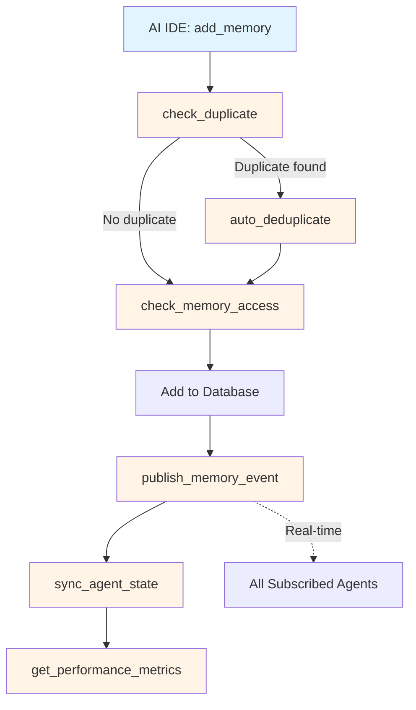

---

#### 2. update_memory (A - Auto)

**Primary Trigger:** AI IDE needs to correct information

**System Triggers:**
```
update_memory (A)
  |
  +---> check_duplicate (S) [System checks if update creates duplicate]
  |
  +---> Update memory in database
  |
  +---> publish_memory_event (S) [System publishes "memory_updated" event]
  |
  +---> sync_agent_state (S) [System syncs with shared agents]
  |
  +---> get_summary_stats (S) [System checks if summary needs update]
```

**Mermaid Diagram:**
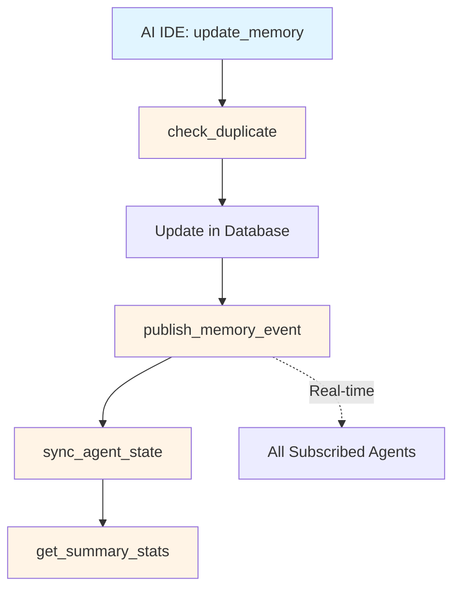

---

#### 3. delete_memory (M - Manual)

**Primary Trigger:** User explicitly deletes

**System Triggers:**
```
delete_memory (M)
  |
  +---> check_memory_sharing (S) [System checks if memory is shared]
  |
  +---> Delete from database
  |
  +---> publish_memory_event (S) [System publishes "memory_deleted" event]
  |
  +---> sync_agent_state (S) [System notifies all agents with access]
```

**Mermaid Diagram:**
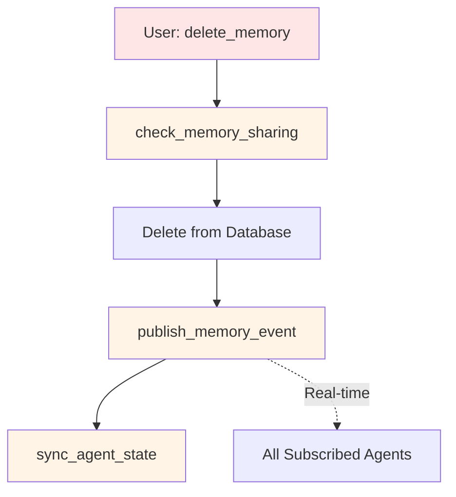

---

#### 4. search_memories (A - Auto)

**Primary Trigger:** AI IDE searches based on user query

**System Triggers:**
```
search_memories (A)
  |
  +---> get_performance_metrics (S) [System logs search performance]
  |
  +---> Search database
  |
  +---> If search_time > threshold --> get_slow_queries (S) [System logs slow query]
```

**Mermaid Diagram:**
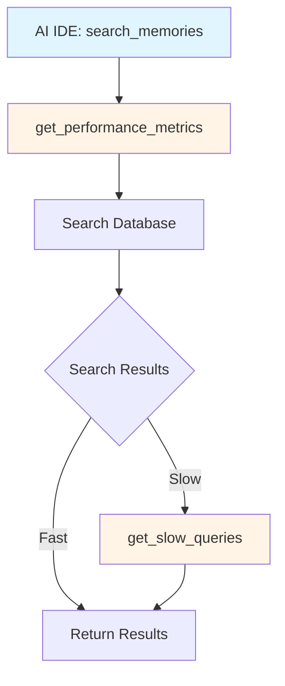

---

### Maintenance Operations

#### 5. expire_memories (M - Manual)

**Primary Trigger:** User explicitly triggers expiration

**System Triggers:**
```
expire_memories (M)
  |
  +---> get_memory_age_stats (S) [System gets age distribution]
  |
  +---> Identify memories to expire
  |
  +---> expire/delete old memories
  |
  +---> publish_memory_event (S) [System publishes "memory_expired" event]
  |
  +---> get_summary_stats (S) [System updates summary statistics]
  |
  +---> get_performance_metrics (S) [System logs performance]
```

**Mermaid Diagram:**
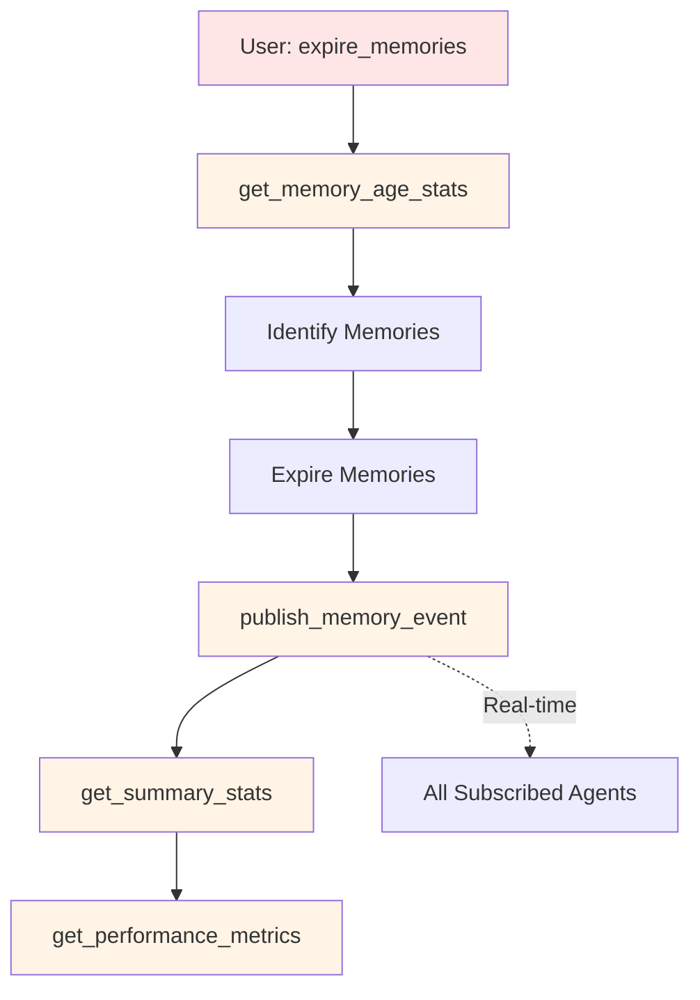

---

#### 6. set_memory_ttl (M - Manual)

**Primary Trigger:** User sets TTL policy

**System Triggers:**
```
set_memory_ttl (M)
  |
  +---> get_memory_age_stats (S) [System updates age tracking]
  |
  +---> Set TTL for memory
  |
  +---> get_performance_metrics (S) [System logs operation]
```

---

#### 7. archive_category (M - Manual)

**Primary Trigger:** User explicitly archives

**System Triggers:**
```
archive_category (M)
  |
  +---> get_memory_age_stats (S) [System gets category stats]
  |
  +---> Archive memories
  |
  +---> publish_memory_event (S) [System publishes "memory_archived" event]
  |
  +---> get_summary_stats (S) [System updates statistics]
```

---

### Deduplication Operations

#### 8. check_duplicate (S - System)

**Primary Trigger:** Called by add_memory or update_memory

**System Triggers:**
```
check_duplicate (S)
  |
  +---> Check exact match
  |
  +---> Check vector similarity
  |
  +---> If similarity > threshold --> auto_deduplicate (S)
  |
  +---> Return result
```

---

#### 9. auto_deduplicate (S - System)

**Primary Trigger:** Called by check_duplicate or scheduled

**System Triggers:**
```
auto_deduplicate (S)
  |
  +---> Find all duplicates
  |
  +---> Merge or delete duplicates
  |
  +---> publish_memory_event (S) [System publishes "memory_deduplicated" event]
  |
  +---> get_deduplication_stats (S) [System updates statistics]
  |
  +---> get_performance_metrics (S) [System logs operation]
```

**Mermaid Diagram:**
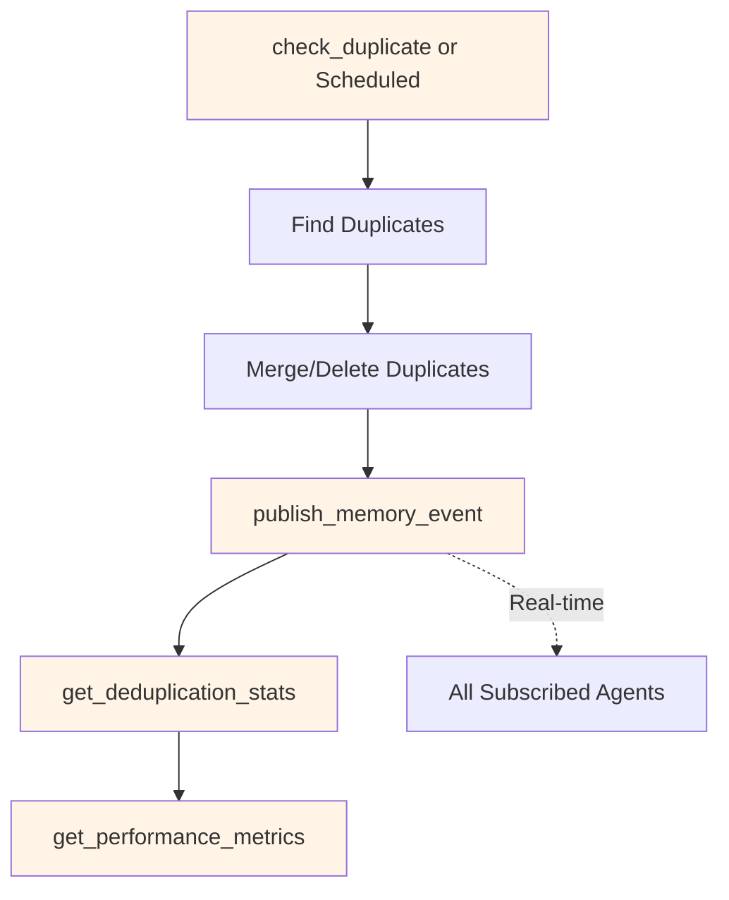

---

### Summarization Operations

#### 10. summarize_old_memories (S - System)

**Primary Trigger:** Scheduled or called by system

**System Triggers:**
```
summarize_old_memories (S)
  |
  +---> get_memory_age_stats (S) [System identifies old memories]
  |
  +---> Summarize old memories
  |
  +---> publish_memory_event (S) [System publishes "memory_summarized" event]
  |
  +---> get_summary_stats (S) [System updates statistics]
  |
  +---> get_performance_metrics (S) [System logs operation]
```

---

#### 11. summarize_category (S - System)

**Primary Trigger:** Called by system when category grows large

**System Triggers:**
```
summarize_category (S)
  |
  +---> get_summary_stats (S) [System checks if category needs summarization]
  |
  +---> Summarize category memories
  |
  +---> publish_memory_event (S) [System publishes "category_summarized" event]
  |
  +---> get_performance_metrics (S) [System logs operation]
```

---

### Sharing Operations

#### 12. set_memory_sharing (A - Auto)

**Primary Trigger:** AI IDE or system sets sharing policy

**System Triggers:**
```
set_memory_sharing (A)
  |
  +---> set_memory_sharing in database
  |
  +---> publish_memory_event (S) [System publishes "sharing_updated" event]
  |
  +---> sync_agent_state (S) [System syncs with newly allowed agents]
```

---

#### 13. create_shared_space (A - Auto)

**Primary Trigger:** System detects collaboration need

**System Triggers:**
```
create_shared_space (A)
  |
  +---> Create shared space
  |
  +---> publish_memory_event (S) [System publishes "space_created" event]
  |
  +---> sync_agent_state (S) [System syncs all members]
```

---

### Backup & Recovery Operations

#### 14. create_backup (S - System)

**Primary Trigger:** Scheduled or system-triggered

**System Triggers:**
```
create_backup (S)
  |
  +---> Backup all databases
  |
  +---> verify_backup (S) [System verifies backup integrity]
  |
  +---> get_performance_metrics (S) [System logs operation]
  |
  +---> publish_memory_event (S) [System publishes "backup_created" event]
```

---

#### 15. restore_backup (S - System)

**Primary Trigger:** System detects need for restoration

**System Triggers:**
```
restore_backup (S)
  |
  +---> Restore from backup
  |
  +---> If failure --> rollback_restore (S) [System automatically rolls back]
  |
  +---> health (S) [System checks all databases]
  |
  +---> publish_memory_event (S) [System publishes "backup_restored" event]
```

**Mermaid Diagram:**
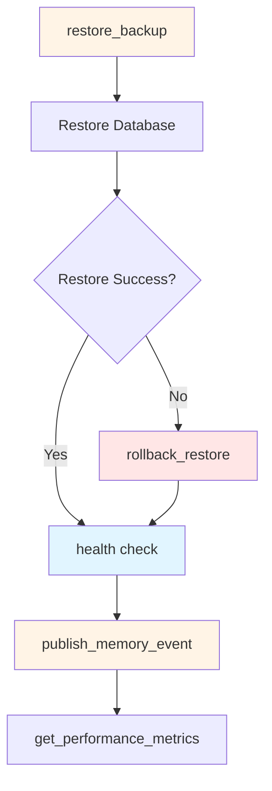

---

### System Health & Monitoring

#### 16. health (S - System)

**Primary Trigger:** System startup, periodic checks, or after critical operations

**System Triggers:**
```
health (S)
  |
  +---> Check PostgreSQL
  |
  +---> Check Qdrant
  |
  +---> Check Neo4j
  |
  +---> Check Redis
  |
  +---> If any unhealthy --> get_performance_metrics (S)
  |
  +---> Return health status
```

---

#### 17. get_stats (S - System)

**Primary Trigger:** System diagnostics, periodic monitoring

**System Triggers:**
```
get_stats (S)
  |
  +---> get_deduplication_stats (S)
  |
  +---> get_summary_stats (S)
  |
  +---> get_memory_age_stats (S)
  |
  +---> Compile all statistics
```

---

### Sync Operations

#### 18. sync_agent_state (S - System)

**Primary Trigger:** Called after any memory change

**System Triggers:**
```
sync_agent_state (S)
  |
  +---> check_memory_access (S) [System checks who has access]
  |
  +---> Sync memories to agents
  |
  +---> publish_memory_event (S) [System publishes "agent_synced" event]
  |
  +---> get_performance_metrics (S) [System logs sync performance]
```

**Mermaid Diagram:**
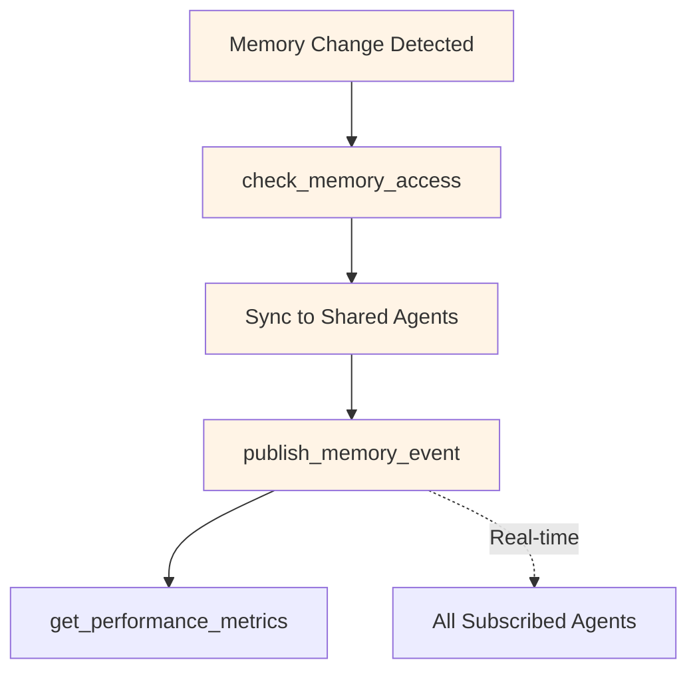

---

## Complete Automation Flow Diagram

```mermaid
flowchart TB
    subgraph "User Actions (Manual)"
        M1[delete_memory]
        M2[expire_memories]
        M3[set_memory_ttl]
        M4[archive_category]
    end

    subgraph "AI IDE Actions (Auto)"
        A1[add_memory]
        A2[update_memory]
        A3[search_memories]
        A4[get_memories]
        A5[get_memory]
        A6[cognify]
        A7[set_memory_sharing]
    end

    subgraph "System Automation (System)"
        S1[check_duplicate]
        S2[auto_deduplicate]
        S3[publish_memory_event]
        S4[sync_agent_state]
        S5[get_performance_metrics]
        S6[check_memory_access]
        S7[get_deduplication_stats]
        S8[get_summary_stats]
        S9[get_memory_age_stats]
        S10[health]
        S11[verify_backup]
        S12[rollback_restore]
    end

    M1 --> S3
    M1 --> S4
    M2 --> S9
    M2 --> S3
    M2 --> S8
    M3 --> S9
    M4 --> S9
    M4 --> S3
    M4 --> S8

    A1 --> S1
    A1 -.->|Duplicate| S2
    A1 --> S6
    A1 --> S3
    A1 --> S4
    A1 --> S5
    A2 --> S3
    A2 --> S4
    A3 --> S5
    A4 --> S5
    A5 --> S5
    A6 --> S5
    A7 --> S3
    A7 --> S4

    S2 --> S3
    S2 --> S7
    S2 --> S5
    S3 --> S4
    S4 --> S5
    S10 --> S5
    S11 --> S5
    S12 --> S10

    S3 -.->|WebSocket| Agents[All Agents]
    S4 -.->|Redis Pub/Sub| Agents

    style M1 fill:#ffe6e6
    style M2 fill:#ffe6e6
    style M3 fill:#ffe6e6
    style M4 fill:#ffe6e6

    style A1 fill:#e1f5ff
    style A2 fill:#e1f5ff
    style A3 fill:#e1f5ff
    style A4 fill:#e1f5ff
    style A5 fill:#e1f5ff
    style A6 fill:#e1f5ff
    style A7 fill:#e1f5ff

    style S1 fill:#fff4e6
    style S2 fill:#fff4e6
    style S3 fill:#fff4e6
    style S4 fill:#fff4e6
    style S5 fill:#fff4e6
    style S6 fill:#fff4e6
    style S7 fill:#fff4e6
    style S8 fill:#fff4e6
    style S9 fill:#fff4e6
    style S10 fill:#e1f5ff
    style S11 fill:#fff4e6
    style S12 fill:#ffe6e6
```

---

## Implementation Phases

### Phase 1: Critical Dependencies ✅ (Implemented)

**Status: COMPLETE**

1. ✅ `add_memory` → `check_duplicate` → `auto_deduplicate` (if needed) → `publish_memory_event`
2. ✅ `update_memory` → `publish_memory_event` → `sync_agent_state`
3. ✅ `delete_memory` → `publish_memory_event` → `sync_agent_state`
4. ✅ Maintenance scheduler auto-start

**What Was Done:**
- Modified `add_memory` to automatically call `check_duplicate` before adding
- Modified `add_memory` to automatically call `publish_memory_event` after adding
- Modified `update_memory` to automatically call `publish_memory_event` after updating
- Modified `delete_memory` to call `publish_memory_event` (but remains manual trigger)
- Modified `init_sprint8_modules` to auto-start maintenance scheduler

---

### Phase 2: Performance Monitoring (Next Priority)

**Status: PENDING**

1. `search_memories` → `get_performance_metrics` → `get_slow_queries` (if slow)
2. All memory operations → `get_performance_metrics` (logging)
3. Scheduled operations → `verify_backup` + `health` checks

**Implementation Plan:**
- Wrap all memory operations with performance tracking
- Log performance metrics after each operation
- Trigger slow query logging when operations exceed threshold
- Add health checks after backup/restore operations

---

### Phase 3: Advanced Automation (Future Enhancement)

**Status: PENDING**

1. `set_memory_sharing` → `sync_agent_state` (auto-sync newly shared memories)
2. `create_backup` → `verify_backup` → `get_performance_metrics` → `publish_memory_event`
3. `restore_backup` → `health` → `rollback_restore` (if fails) → `publish_memory_event`
4. `summarize_old_memories` → `get_memory_age_stats` → `publish_memory_event` → `get_summary_stats`
5. `archive_category` → `get_memory_age_stats` → `publish_memory_event` → `get_summary_stats`
6. `expire_memories` → `get_memory_age_stats` → `publish_memory_event` → `get_summary_stats`

---

## Tool Classification Summary

| # | Tool Name | Trigger Type | System Chain | Status |
|---|-----------|--------------|--------------|--------|
| 1 | add_memory | Auto | check_duplicate → auto_deduplicate → publish_memory_event → sync_agent_state | ✅ Phase 1 |
| 2 | search_memories | Auto | get_performance_metrics → get_slow_queries | ⏳ Phase 2 |
| 3 | get_memories | Auto | get_performance_metrics | ⏳ Phase 2 |
| 4 | get_memory | Auto | get_performance_metrics | ⏳ Phase 2 |
| 5 | update_memory | Auto | publish_memory_event → sync_agent_state | ✅ Phase 1 |
| 6 | delete_memory | Manual | publish_memory_event → sync_agent_state | ✅ Phase 1 |
| 7 | list_agents | Auto | get_performance_metrics | ⏳ Phase 2 |
| 8 | cognify | Auto | get_performance_metrics → publish_memory_event | ⏳ Phase 2 |
| 9 | search | Auto | get_performance_metrics | ⏳ Phase 2 |
| 10 | list_data | Auto | get_performance_metrics | ⏳ Phase 2 |
| 11 | get_stats | System | get_deduplication_stats → get_summary_stats → get_memory_age_stats | ⏳ Phase 2 |
| 12 | health | System | get_performance_metrics (if unhealthy) | ⏳ Phase 2 |
| 13 | expire_memories | Manual | get_memory_age_stats → publish_memory_event → get_summary_stats → get_performance_metrics | ⏳ Phase 3 |
| 14 | get_memory_age_stats | System | get_performance_metrics | ⏳ Phase 2 |
| 15 | set_memory_ttl | Manual | get_memory_age_stats → get_performance_metrics | ⏳ Phase 3 |
| 16 | archive_category | Manual | get_memory_age_stats → publish_memory_event → get_summary_stats | ⏳ Phase 3 |
| 17 | check_duplicate | System | auto_deduplicate (if needed) | ✅ Phase 1 |
| 18 | auto_deduplicate | System/Scheduled | publish_memory_event → get_deduplication_stats → get_performance_metrics | ⏳ Phase 2 |
| 19 | get_deduplication_stats | System | get_performance_metrics | ⏳ Phase 2 |
| 20 | summarize_old_memories | System/Scheduled | get_memory_age_stats → publish_memory_event → get_summary_stats → get_performance_metrics | ⏳ Phase 3 |
| 21 | summarize_category | System | get_summary_stats → publish_memory_event → get_performance_metrics | ⏳ Phase 3 |
| 22 | get_summary_stats | System | get_performance_metrics | ⏳ Phase 2 |
| 23 | get_performance_metrics | System | (logging operation) | ⏳ Phase 2 |
| 24 | get_slow_queries | System | get_performance_metrics | ⏳ Phase 2 |
| 25 | get_prometheus_metrics | System | get_performance_metrics | ⏳ Phase 2 |
| 26 | set_memory_sharing | Auto | publish_memory_event → sync_agent_state | ⏳ Phase 3 |
| 27 | check_memory_access | System | (access control check) | ⏳ Phase 2 |
| 28 | get_shared_memories | Auto | get_performance_metrics | ⏳ Phase 2 |
| 29 | create_shared_space | Auto | publish_memory_event → sync_agent_state | ⏳ Phase 3 |
| 30 | publish_memory_event | System | sync_agent_state | ✅ Phase 1 |
| 31 | get_sync_status | System | get_performance_metrics | ⏳ Phase 2 |
| 32 | sync_agent_state | System | check_memory_access → publish_memory_event → get_performance_metrics | ⏳ Phase 2 |
| 33 | create_backup | System/Scheduled | verify_backup → get_performance_metrics → publish_memory_event | ⏳ Phase 3 |
| 34 | restore_backup | System | health → rollback_restore (if fails) → publish_memory_event | ⏳ Phase 3 |
| 35 | list_backups | Auto | get_performance_metrics | ⏳ Phase 2 |
| 36 | verify_backup | System | get_performance_metrics | ⏳ Phase 2 |
| 37 | rollback_restore | System | health → get_performance_metrics | ⏳ Phase 3 |

---

## Key Automation Principles

### 1. Dependency Chain Automation
When a tool is triggered, the system automatically evaluates dependencies and triggers necessary follow-up tools:
- **Before:** Validation, checking, conflict detection
- **During:** Main operation execution
- **After:** Cleanup, notifications, synchronization, monitoring

### 2. Event-Driven Architecture
All significant operations publish events via `publish_memory_event`, which triggers:
- Real-time agent synchronization
- Dashboard updates
- Monitoring and analytics
- Audit logging

### 3. Performance Monitoring
All operations log performance metrics, enabling:
- Slow query detection
- Performance optimization
- Capacity planning
- Health monitoring

### 4. Self-Healing Mechanisms
System automatically handles failures:
- Failed restores trigger rollback
- Failed operations trigger health checks
- Duplicate detection triggers cleanup
- Backup verification ensures data integrity

---

## Decision Trees

### When add_memory is Called:

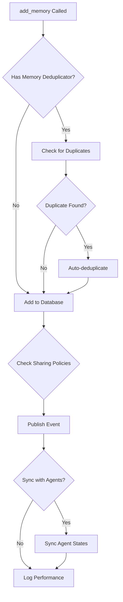

### When create_backup is Called:

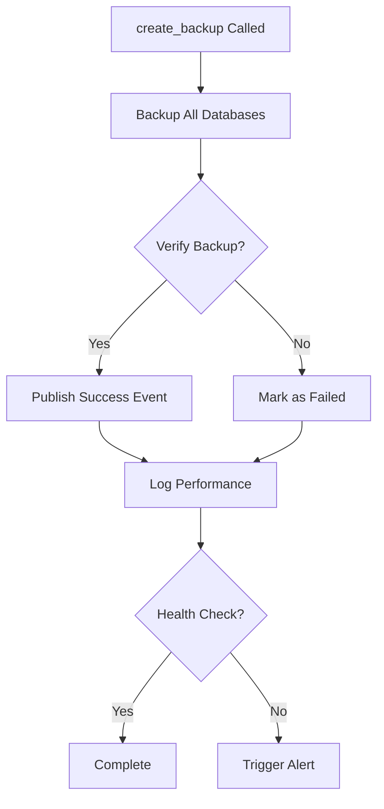

---

## Benefits of Comprehensive Automation

### 1. Data Integrity
- Automatic duplicate detection and removal
- Automatic backup verification
- Automatic rollback on failures

### 2. Consistency
- Automatic synchronization across agents
- Automatic event publishing
- Automatic state updates

### 3. Performance
- Automatic performance monitoring
- Automatic slow query detection
- Automatic optimization triggers

### 4. Reliability
- Automatic health checks
- Automatic failure recovery
- Automatic maintenance tasks

### 5. Observability
- Automatic metrics collection
- Automatic event logging
- Automatic statistics updates

---

## Next Steps

### Immediate (Phase 2)
1. Implement performance monitoring wrappers
2. Add slow query detection
3. Implement health check triggers

### Short-term (Phase 3)
1. Implement full backup/restore automation chains
2. Add comprehensive statistics collection
3. Implement complete sync automation

### Long-term
1. Machine learning-based optimization
2. Predictive maintenance
3. Advanced anomaly detection

---

**Document Version:** 1.0
**Date:** 2026-02-07
**Status:** Phase 1 Complete, Phases 2-3 Pending
