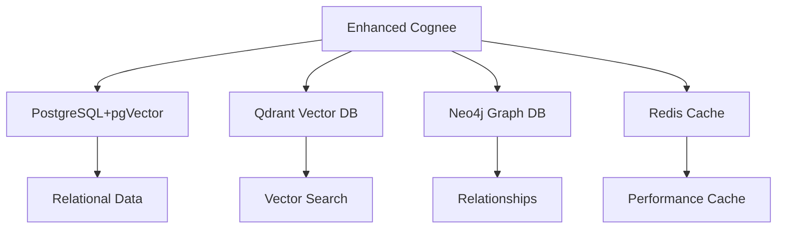

# Enhanced Cognee MCP Server - Comprehensive User Guide

## 🧠 Table of Contents

1. [Introduction](#introduction)
2. [What is Enhanced Cognee?](#what-is-enhanced-cognee)
3. [Why Use Enhanced Cognee?](#why-use-enhanced-cognee)
4. [Key Features](#key-features)
5. [Getting Started](#getting-started)
6. [Memory Management](#memory-management)
7. [Project-Aware Features](#project-aware-features)
8. [Integration with IDEs](#integration-with-ides)
9. [Advanced Usage](#advanced-usage)
10. [Best Practices](#best-practices)
11. [Troubleshooting](#troubleshooting)
12. [FAQ](#faq)

## 🎯 Introduction

Enhanced Cognee is a powerful, enterprise-grade memory management system designed specifically for AI-powered development environments. It provides intelligent, context-aware memory capabilities that enhance your productivity across all projects.

## 🚀 What is Enhanced Cognee?

Enhanced Cognee is an **MCP (Model Context Protocol) Server** that provides:

- **Persistent Memory**: Store and retrieve information across sessions
- **Intelligent Categorization**: Automatically organize memories by project type
- **Cross-Project Learning**: Leverage insights from previous projects
- **Enterprise Database Stack**: PostgreSQL, Qdrant, Neo4j, Redis integration
- **Multi-IDE Compatibility**: Works with Claude Desktop, Cursor, VS Code, and more

## 💡 Why Use Enhanced Cognee?

### 🔄 Eliminate Repetition
- **Never repeat explanations**: Enhanced Cognee remembers your project decisions
- **Consistent context**: Maintain project understanding across sessions
- **Cross-project insights**: Apply learnings from one project to another

### 🧠 Enhanced Intelligence
- **Smart categorization**: Memories automatically organized by project type
- **Contextual retrieval**: Find relevant information based on current context
- **Pattern recognition**: Identify and leverage development patterns

### 🏗️ Enterprise Architecture
- **Scalable databases**: Handles large-scale memory storage efficiently
- **Fast retrieval**: Vector similarity search for quick information access
- **Relationship mapping**: Graph database for complex knowledge relationships

## 🌟 Key Features

### 🗄️ Database Stack



- **PostgreSQL + pgVector**: Structured data with vector similarity
- **Qdrant**: High-performance vector database for semantic search
- **Neo4j**: Graph database for relationship mapping
- **Redis**: High-speed caching layer

### 🎯 Memory Categorization

#### Multi-Agent System Projects
- `ats_` - Algorithmic Trading System memories
- `oma_` - Other Multi-Agent memories
- `smc_` - Shared Multi-Agent Components

#### Web Development Projects
- `fe_` - Frontend memories (React, Vue, etc.)
- `be_` - Backend memories (APIs, databases)
- `dev_` - DevOps and deployment memories

#### Python Projects
- `code_` - Code architecture and patterns
- `data_` - Data structures and processing
- `config_` - Configuration and environment

#### Data Science Projects
- `model_` - Machine learning models
- `data_` - Datasets and preprocessing
- `exp_` - Experiments and results

#### General Projects
- `mem_` - General memories
- `task_` - Task-specific information
- `note_` - Notes and documentation

### 🔄 Project-Aware Detection

Enhanced Cognee automatically detects your project type:

1. **Path Analysis**: Scans directory structure
2. **File Detection**: Looks for project indicators
3. **Configuration Reading**: Analyzes project files
4. **Smart Assignment**: Applies appropriate categorization

## 🚀 Getting Started

### Quick Installation

```bash
# Download and run the installer
curl -fsSL https://raw.githubusercontent.com/your-username/enhanced-cognee/main/install.py | python

# Or clone and install manually
git clone https://github.com/your-username/enhanced-cognee.git
cd enhanced-cognee
python install.py
```

### What Gets Installed

- ✅ **Enhanced Cognee Server**: Universal MCP server
- ✅ **Database Stack**: PostgreSQL, Qdrant, Neo4j, Redis
- ✅ **Configuration Files**: Ready-to-use IDE configs
- ✅ **Desktop Shortcuts**: Easy server startup
- ✅ **Documentation**: Complete user guides

## 💾 Memory Management

### Storing Memories

Use natural language to store information:

```
"Remember that we decided to use React for the frontend"
"Store this API endpoint design pattern"
"Note that the database schema uses UUIDs for primary keys"
"Save this troubleshooting solution for future reference"
```

### Retrieving Memories

Query your stored knowledge:

```
"What did we decide about user authentication?"
"Show me similar API patterns from other projects"
"What did we learn about performance optimization?"
"Find all frontend-related decisions for this project"
```

### Memory Types

#### **Semantic Memory**
- General knowledge and concepts
- Cross-applicable patterns
- Best practices and guidelines

#### **Episodic Memory**
- Project-specific decisions
- Historical context and reasons
- Timeline of changes

#### **Procedural Memory**
- How-to instructions
- Step-by-step processes
- Workflow patterns

#### **Factual Memory**
- Technical specifications
- Configuration details
- Code snippets and examples

#### **Working Memory**
- Current session context
- Temporary information
- Active project state

## 🎯 Project-Aware Features

### Automatic Project Detection

Enhanced Cognee automatically identifies project types:

#### **Multi-Agent System Detection**
```
/Projects/AI-Agents/enhanced-cognee/  → Multi-Agent System
/Projects/trading-system/             → Multi-Agent System
/agent-coordination/                  → Multi-Agent System
```

#### **Web Development Detection**
```
package.json, next.config.js         → Web Development
react/, vue/, angular/               → Web Development
webpack.config.js                    → Web Development
```

#### **Python Project Detection**
```
requirements.txt, pyproject.toml     → Python Project
Django/Flask apps                    → Python Project
Python packages/libraries            → Python Project
```

### Context Switching

When you switch between projects, Enhanced Cognee:

1. **Detects New Context**: Identifies project type
2. **Loads Relevant Memories**: Retrieves project-specific knowledge
3. **Applies Appropriate Categorization**: Uses correct memory prefixes
4. **Maintains Context**: Keeps project understanding active

### Cross-Project Learning

Enhanced Cognee can leverage knowledge from other projects:

```
"How did we handle user authentication in the e-commerce project?"
"What performance optimizations did we use in the data pipeline?"
"Show me React patterns from previous frontend projects"
```

## 🔧 Integration with IDEs

### Claude Desktop

```json
// AppData/Roaming/Claude/claude_desktop_config.json
{
  "mcpServers": {
    "enhanced-cognee": {
      "command": "python",
      "args": ["/path/to/enhanced-cognee/cognee_mcp_universal.py"],
      "env": {
        "PYTHONPATH": "/path/to/enhanced-cognee"
      }
    }
  }
}
```

### VS Code (Continue Extension)

```json
// ~/.continue/config.json
{
  "mcpServers": {
    "enhanced-cognee": {
      "command": "python",
      "args": ["/path/to/enhanced-cognee/cognee_mcp_universal.py"]
    }
  }
}
```

### Cursor

```json
// Cursor MCP Settings
{
  "enhanced-cognee": {
    "command": "python",
    "args": ["/path/to/enhanced-cognee/cognee_mcp_universal.py"],
    "cwd": "/path/to/enhanced-cognee"
  }
}
```

### Windsurf

```json
// Windsurf MCP Configuration
{
  "servers": {
    "enhanced-cognee": {
      "executable": "python",
      "args": ["/path/to/cognee_mcp_universal.py"],
      "workingDirectory": "/path/to/enhanced-cognee"
    }
  }
}
```

## 🎓 Advanced Usage

### Custom Memory Categories

Define your own memory categories for specific projects:

```python
# In your project, create a .cognee-config.json
{
  "project_type": "custom",
  "memory_prefixes": {
    "feature_": "New features and functionality",
    "bugfix_": "Bug fixes and solutions",
    "refactor_": "Code refactoring decisions",
    "research_": "Research findings and experiments"
  }
}
```

### Memory Search Techniques

#### **Semantic Search**
```
"Find memories about database optimization"
"Search for API design patterns"
"Look up frontend performance techniques"
```

#### **Keyword Search**
```
"Find all memories containing authentication"
"Search for memories about React hooks"
"Look up docker configuration"
```

#### **Category-Based Search**
```
"Show me all frontend memories"
"Find backend API decisions"
"Display all bug fixes"
```

### Memory Relationships

Enhanced Cognee tracks relationships between memories:

```
"What's related to our user authentication decision?"
"Show me dependencies of the database schema"
"What other decisions influenced our API design?"
```

### Memory Analytics

Get insights about your stored knowledge:

```
"How many memories do we have for this project?"
"What are our most common topics?"
"Show me memory trends over time"
```

## 🏆 Best Practices

### Memory Management

1. **Be Specific**: Store detailed, actionable information
   ```
   ✅ "Use JWT tokens with 24-hour expiration for API authentication"
   ❌ "Remember the auth thing"
   ```

2. **Provide Context**: Include reasons and background
   ```
   ✅ "Chose PostgreSQL over MySQL because we needed JSONB support for complex data structures"
   ❌ "Used PostgreSQL"
   ```

3. **Use Categories**: Leverage automatic categorization
   ```
   ✅ "Store this in frontend memories: React component structure using hooks"
   ❌ "Remember the React thing"
   ```

### Project Organization

1. **Consistent Naming**: Use consistent terminology across projects
2. **Regular Cleanup**: Review and organize stored memories
3. **Cross-Reference**: Link related concepts and decisions

### Performance Optimization

1. **Specific Queries**: Use targeted search terms
2. **Category Filtering**: Search within specific memory types
3. **Regular Maintenance**: Keep memory database optimized

## 🔧 Troubleshooting

### Common Issues

#### **Server Won't Start**
```bash
# Check Python environment
python --version
pip list | grep cognee

# Check database connections
docker ps | grep cognee
```

#### **Database Connection Errors**
```bash
# Restart Docker containers
docker-compose -f docker-compose-enhanced-cognee.yml restart

# Check network connectivity
docker network ls | grep enhanced-cognee
```

#### **Memory Not Saving**
```bash
# Check server logs
python cognee_mcp_universal.py --verbose

# Verify database status
docker-compose logs postgres
```

### Getting Help

1. **Check Logs**: Look for error messages in server output
2. **Verify Configuration**: Double-check paths and environment variables
3. **Test Components**: Test each component individually
4. **Community Support**: Check GitHub issues and forums

## ❓ FAQ

### Q: Does Enhanced Cognee work offline?
A: Yes, Enhanced Cognee works offline. Only the initial LLM calls require internet connection.

### Q: How much storage does it use?
A: Storage usage depends on your memory volume. Typically starts at a few hundred MB and grows with usage.

### Q: Can I use it with multiple IDEs simultaneously?
A: Yes, Enhanced Cognee supports multiple IDE connections simultaneously.

### Q: Is my data private?
A: Yes, all data is stored locally in your Docker containers and is not sent to external servers.

### Q: How do I backup my memories?
A: Backup the Docker volumes: `docker run --rm -v enhanced_cognee_data:/data -v $(pwd):/backup alpine tar czf /backup/cognee-backup.tar.gz -C /data .`

### Q: Can I customize the memory categories?
A: Yes, you can define custom categories for your specific project types.

### Q: How does it compare to other memory solutions?
A: Enhanced Cognee offers enterprise-grade features, project-aware categorization, and multi-database architecture that surpasses basic memory solutions.

### Q: What's the performance like?
A: With Redis caching and optimized databases, Enhanced Cognee provides sub-second memory retrieval and storage.

## 📚 Additional Resources

- [Cross-IDE Installation Guide](./CROSS_IDE_INSTALLATION.md)
- [API Documentation](./API_REFERENCE.md)
- [Troubleshooting Guide](./TROUBLESHOOTING.md)
- [Docker Configuration Guide](./DOCKER_GUIDE.md)
- [GitHub Repository](https://github.com/your-username/enhanced-cognee)
- [Discord Community](https://discord.gg/enhanced-cognee)

## 🤝 Contributing

We welcome contributions! Please see our [Contributing Guide](./CONTRIBUTING.md) for details.

## 📄 License

Enhanced Cognee is licensed under the MIT License. See [LICENSE](../LICENSE) for details.

---

**Need help?** Join our [Discord Community](https://discord.gg/enhanced-cognee) or check our [GitHub Issues](https://github.com/your-username/enhanced-cognee/issues).