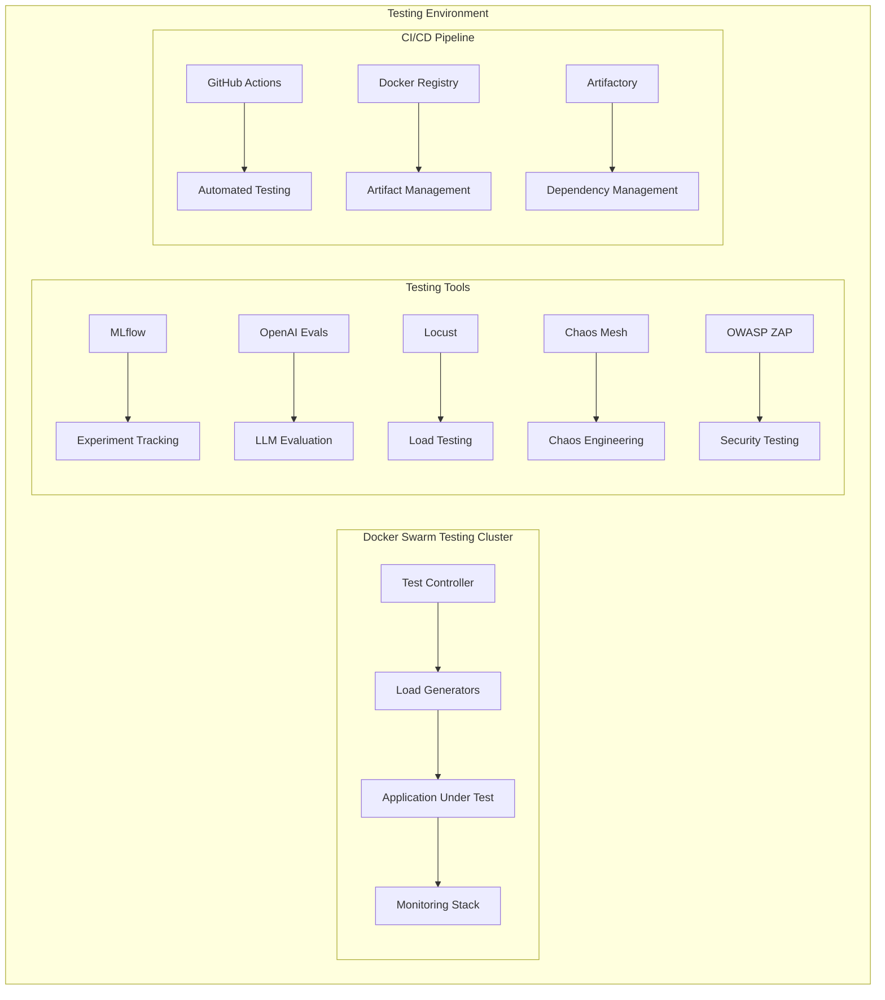

# Enhanced Cognee Comprehensive Testing Strategy

## 📋 Table of Contents

1. [Executive Summary](#executive-summary)
2. [Testing Objectives](#testing-objectives)
3. [System Overview](#system-overview)
4. [Testing Infrastructure Architecture](#testing-infrastructure-architecture)
5. [10-Category Testing Framework](#10-category-testing-framework)
6. [Scenario-Based Testing](#scenario-based-testing)
7. [Code Coverage Strategy](#code-coverage-strategy)
8. [Success Metrics & KPIs](#success-metrics--kpis)
9. [Implementation Timeline](#implementation-timeline)
10. [Risk Management](#risk-management)
11. [Documentation Structure](#documentation-structure)

---

## 🎯 Executive Summary

This document outlines a comprehensive testing strategy for the Enhanced Cognee system, an enterprise-grade memory architecture supporting a 21-agent Multi-Agent System with ATS/OMA/SMC categorization. The strategy ensures **>95% code coverage**, **100% test success rate**, and **enterprise-scale validation** for 1000+ concurrent agents.

### Key Objectives
- **Scenario-Based Testing**: Complete end-to-end workflow verification
- **Comprehensive Coverage**: 10 distinct test categories covering all aspects
- **Enterprise Scale**: Validation for 1000+ concurrent agents
- **Open-Source Stack**: Cost-effective testing infrastructure
- **Compliance Framework**: Financial, privacy, security, and software standards

### Scope
- **System Components**: Memory stack (PostgreSQL+pgVector, Qdrant, Neo4j, Redis), 21 agents, coordination system
- **Test Coverage**: 978 Python files across unit, integration, system, and specialized testing
- **Performance Targets**: 10K+ memory operations/second, <100ms API response time
- **Compliance Standards**: SOC 2, PCI DSS, GDPR, CCPA, ISO 27001, NIST

---

## 🎯 Testing Objectives

### Primary Objectives
1. **Functional Correctness**: Ensure all components work as specified
2. **Performance Validation**: Meet enterprise-scale performance requirements
3. **Security Assurance**: Comprehensive security and vulnerability testing
4. **Compliance Verification**: Meet all regulatory and industry standards
5. **Reliability Assurance**: System resilience and fault tolerance validation

### Success Criteria
- **Code Coverage**: >95% line and branch coverage across all components
- **Test Success Rate**: 100% with zero warnings or failures
- **Performance Benchmarks**: All performance targets met or exceeded
- **Compliance Standards**: Full compliance with all applicable standards
- **Documentation**: Complete test documentation and knowledge transfer

---

## 🏗️ System Overview

### Enhanced Cognee Architecture
```mermaid
graph TB
    subgraph "Memory Stack"
        A[PostgreSQL+pgVector] --> A1[Structured Data]
        B[Qdrant] --> B1[Vector Similarity]
        C[Neo4j] --> C1[Relationship Graph]
        D[Redis] --> D1[High-Speed Caching]
    end

    subgraph "Agent System"
        E[ATS Agents - 7] --> E1[Trading System]
        F[OMA Agents - 10] --> F1[Development System]
        G[SMC Agents - 6] --> G1[Coordination System]
    end

    subgraph "Coordination Layer"
        H[Task Orchestration] --> H1[Workflow Management]
        I[Distributed Decision] --> I1[Consensus Building]
        J[Sub-Agent Coordination] --> J1[Agent Management]
    end

    subgraph "Monitoring Stack"
        K[Prometheus] --> K1[Metrics Collection]
        L[Grafana] --> L1[Visualization]
        M[ELK Stack] --> M1[Logging & Analysis]
    end

    Memory Stack --> Agent System
    Agent System --> Coordination Layer
    Coordination Layer --> Monitoring Stack
```

### Component Statistics
- **Total Python Files**: 978 files
- **Core Modules**: 311 files
- **Test Files**: 109 existing files (11% current coverage)
- **Examples**: 22 Python examples
- **Configuration Files**: 45 files (Docker, environment, deployment)

### Critical Integration Points
1. **Memory Integration System**: 21 agents with standardized memory access
2. **Multi-Database Sync**: Simultaneous updates across PostgreSQL, Qdrant, Neo4j, Redis
3. **Cross-Memory Queries**: Unified search across all memory types
4. **Agent Coordination**: Complex multi-agent decision making and task distribution

---

## 🏗️ Testing Infrastructure Architecture

### Open-Source Testing Stack


### Infrastructure Components

#### Testing Cluster Configuration
- **Docker Swarm**: 10-node cluster (3 managers, 7 workers)
- **Resource Allocation**: 16 CPU cores, 64GB RAM per node
- **Network Isolation**: Separate testing network with VLAN segmentation
- **Storage**: Dedicated SSD storage for test data and logs

#### Database Testing Setup
```yaml
# Testing Database Configuration
PostgreSQL_Test:
  Port: 25432
  Database: enhanced_cognee_test
  Replication: Master-Slave setup
  Monitoring: Custom metrics export

Qdrant_Test:
  Port: 26333
  Collections: Separate test collections
  Sharding: 4 shards for performance testing
  Monitoring: Collection-level metrics

Neo4j_Test:
  Port: 27474
  Database: test_graph.db
  Clustering: Single instance for testing
  Monitoring: Query performance tracking

Redis_Test:
  Port: 26379
  Persistence: AOF enabled
  Clustering: Single instance
  Monitoring: Memory usage tracking
```

#### Performance Testing Infrastructure
- **Load Generation**: 5 dedicated Locust masters
- **Metrics Collection**: Prometheus with custom exporters
- **Result Storage**: Time-series database for historical analysis
- **Visualization**: Grafana dashboards for real-time monitoring

---

## 📋 10-Category Testing Framework

### 1. Unit Tests (40% of Total Coverage)

#### Monitoring Modules Testing
```python
# Example Unit Test Structure
class TestMonitoringModules:
    def test_prometheus_metrics_collection(self):
        """Test Prometheus metrics accuracy and format"""

    def test_grafana_dashboard_integrity(self):
        """Test Grafana dashboard data sources and alerts"""

    def test_health_check_endpoints(self):
        """Test system health check endpoints"""

    def test_log_aggregation(self):
        """Test ELK stack log collection and indexing"""
```

#### Autoscaling Modules Testing
```python
class TestAutoscalingModules:
    def test_agent_scaling_logic(self):
        """Test agent scaling decision logic"""

    def test_resource_threshold_detection(self):
        """Test resource monitoring and threshold detection"""

    def test_scale_out_performance(self):
        """Test scale-out operation performance"""

    def test_scale_in_safety(self):
        """Test scale-in operation safety checks"""
```

### 2. Integration Testing (25% of Total Coverage)

#### Memory Stack Integration
```python
class TestMemoryStackIntegration:
    def test_cross_database_consistency(self):
        """Test data consistency across all memory databases"""

    def test_memory_synchronization(self):
        """Test real-time memory synchronization"""

    def test_transaction_integrity(self):
        """Test distributed transaction integrity"""

    def test_failover_scenarios(self):
        """Test database failover and recovery scenarios"""
```

#### Agent Communication Integration
```python
class TestAgentCommunicationIntegration:
    def test_ats_oma_coordination(self):
        """Test ATS-OMA agent coordination protocols"""

    def test_smc_shared_memory(self):
        """Test SMC shared memory functionality"""

    def test_message_routing(self):
        """Test inter-agent message routing"""

    def test_protocol_compliance(self):
        """Test communication protocol compliance"""
```

### 3. System Testing (15% of Total Coverage)

#### End-to-End Workflow Testing
```python
class TestSystemWorkflows:
    def test_trading_algorithm_execution(self):
        """Test complete trading algorithm workflow"""

    def test_code_review_process(self):
        """Test complete code review workflow"""

    def test_memory_lifecycle(self):
        """Test complete memory lifecycle management"""

    def test_coordination_orchestration(self):
        """Test multi-agent coordination orchestration"""
```

### 4. User Acceptance Testing (UAT) (5% of Total Coverage)

#### Business Requirement Validation
```python
class TestBusinessRequirements:
    def test_trading_accuracy_requirements(self):
        """Test trading algorithm accuracy meets business requirements"""

    def test_code_review_quality_standards(self):
        """Test code review meets quality standards"""

    def test_performance_sla_compliance(self):
        """Test performance meets service level agreements"""

    def test_usability_requirements(self):
        """Test system meets usability requirements"""
```

### 5. Performance Testing (5% of Total Coverage)

#### Load and Stress Testing
```python
class TestPerformanceRequirements:
    def test_concurrent_agent_load(self):
        """Test system with 1000+ concurrent agents"""

    def test_memory_operation_throughput(self):
        """Test 10K+ memory operations per second"""

    def test_api_response_times(self):
        """Test API response times under load"""

    def test_resource_utilization_efficiency(self):
        """Test efficient resource utilization"""
```

### 6. Security Testing (3% of Total Coverage)

#### Vulnerability Assessment
```python
class TestSecurityRequirements:
    def test_authentication_authorization(self):
        """Test authentication and authorization mechanisms"""

    def test_data_encryption_standards(self):
        """Test data encryption meets standards"""

    def test_penetration_testing(self):
        """Test system against penetration attacks"""

    def test_security_compliance(self):
        """Test security compliance frameworks"""
```

### 7. Test Automation (3% of Total Coverage)

#### CI/CD Pipeline Testing
```python
class TestAutomationRequirements:
    def test_ci_cd_pipeline_integration(self):
        """Test GitHub Actions pipeline functionality"""

    def test_automated_test_execution(self):
        """Test automated test suite execution"""

    def test_regression_testing(self):
        """Test automated regression testing"""

    def test_deployment_validation(self):
        """Test pre-deployment validation"""
```

### 8. Contract Testing (2% of Total Coverage)

#### API and Protocol Validation
```python
class TestContractRequirements:
    def test_api_contract_compliance(self):
        """Test API compliance with OpenAPI specifications"""

    def test_database_schema_validation(self):
        """Test database schema compliance"""

    def test_agent_protocol_validation(self):
        """Test agent communication protocol compliance"""

    def test_sla_compliance(self):
        """Test service level agreement compliance"""
```

### 9. Chaos Testing (1% of Total Coverage)

#### Resilience Testing
```python
class TestChaosRequirements:
    def test_database_outage_recovery(self):
        """Test system recovery from database outages"""

    def test_network_partition_resilience(self):
        """Test resilience to network partitions"""

    def test_memory_corruption_handling(self):
        """Test memory corruption detection and recovery"""

    def test_resource_exhaustion_behavior(self):
        """Test behavior under resource exhaustion"""
```

### 10. Compliance Testing (1% of Total Coverage)

#### Regulatory Compliance Validation
```python
class TestComplianceRequirements:
    def test_financial_trading_compliance(self):
        """Test SOC 2 and PCI DSS compliance"""

    def test_data_privacy_compliance(self):
        """Test GDPR and CCPA compliance"""

    def test_security_standards_compliance(self):
        """Test ISO 27001 and NIST compliance"""

    def test_software_quality_compliance(self):
        """Test ISO/IEC 25010 compliance"""
```

---

## 🎬 Scenario-Based Testing

### Business Workflow Scenarios

#### Scenario 1: "Add Authentication to Existing Application"
**Objective**: Test complete authentication workflow implementation
**Agents Involved**: Code Reviewer, Security Auditor, Architecture Agent, Development Agent
**Expected Duration**: 45 minutes
**Success Criteria**:
- Authentication implemented correctly
- Security standards met
- Code quality maintained
- Documentation updated

**Test Steps**:
1. Code Reviewer analyzes existing codebase
2. Security Auditor performs security assessment
3. Architecture Agent designs authentication flow
4. Development Agent implements authentication
5. Testing Agent validates implementation
6. Documentation Agent updates documentation
7. Deployment Agent manages deployment

#### Scenario 2: "High-Frequency Trading Algorithm Optimization"
**Objective**: Test trading algorithm optimization under market conditions
**Agents Involved**: Algorithmic Trading System, Risk Management, Market Analysis
**Expected Duration**: 30 minutes
**Success Criteria**:
- Algorithm performance improved
- Risk parameters maintained
- Regulatory compliance maintained
- No system degradation

### Technical Failure Scenarios

#### Scenario 3: "Database Failover During Peak Load"
**Objective**: Test system resilience during database failures
**Components Involved**: PostgreSQL, Qdrant, Neo4j, Redis
**Expected Duration**: 20 minutes
**Success Criteria**:
- Zero data loss
- Graceful degradation
- Automatic recovery
- Performance within SLA

#### Scenario 4: "Network Partition in Multi-Agent Coordination"
**Objective**: Test agent coordination resilience during network issues
**Agents Involved**: All 21 agents, Coordination System
**Expected Duration**: 15 minutes
**Success Criteria**:
- Consistent decision making
- No split-brain scenarios
- Graceful degradation
- Automatic reconciliation

### Mixed Complex Scenarios

#### Scenario 5: "Security Breach During High-Frequency Trading"
**Objective**: Test system response to security incidents during critical operations
**Agents Involved**: All agents, Security System, Monitoring System
**Expected Duration**: 25 minutes
**Success Criteria**:
- Immediate threat detection
- Trading operations protected
- Security incident contained
- Business continuity maintained

#### Scenario 6: "Code Review During System Upgrade"
**Objective**: Test multi-agent coordination during system upgrades
**Agents Involved**: Development, Testing, Deployment, Coordination agents
**Expected Duration**: 40 minutes
**Success Criteria**:
- Zero downtime deployment
- Code quality maintained
- System integrity preserved
- Rollback capability maintained

---

## 📊 Code Coverage Strategy

### Coverage Targets by Component

#### Memory Stack Components (Target: 98% coverage)
```python
# Coverage mapping for memory components
memory_coverage_targets = {
    'PostgreSQL Integration': 99,
    'Qdrant Vector Operations': 98,
    'Neo4j Graph Operations': 97,
    'Redis Caching': 99,
    'Cross-Database Sync': 95,
    'Memory Lifecycle Management': 98,
    'Transaction Management': 97
}
```

#### Agent System Components (Target: 96% coverage)
```python
agent_coverage_targets = {
    'ATS Agents': 97,
    'OMA Agents': 96,
    'SMC Agents': 98,
    'Agent Communication': 95,
    'Agent Coordination': 94,
    'Memory Integration': 97,
    'Decision Making': 96
}
```

#### API and Infrastructure (Target: 94% coverage)
```python
infrastructure_coverage_targets = {
    'REST API Endpoints': 96,
    'GraphQL API': 94,
    'MCP Integration': 95,
    'Docker Infrastructure': 92,
    'Monitoring Stack': 93,
    'CI/CD Pipeline': 91,
    'Configuration Management': 94
}
```

### Coverage Measurement Tools
- **Coverage.py**: Python code coverage measurement
- **Coverage XML Reports**: Integration with CI/CD pipeline
- **SonarQube**: Advanced coverage analysis and quality metrics
- **Coverage Badge Integration**: Real-time coverage tracking

### Coverage Improvement Strategy
1. **Baseline Establishment**: Current coverage measurement and gap analysis
2. **Incremental Improvement**: 5% coverage increase per sprint
3. **Critical Path Focus**: Prioritize coverage for critical business logic
4. **Regression Prevention**: Maintain coverage for all new code

---

## 📈 Success Metrics & KPIs

### Quality Metrics

#### Code Coverage Metrics
- **Line Coverage**: >95% across all components
- **Branch Coverage**: >90% for conditional logic
- **Function Coverage**: 100% for all public APIs
- **Critical Path Coverage**: 100% for business-critical workflows

#### Test Success Metrics
- **Test Pass Rate**: 100% with zero failures
- **Test Stability**: <5% flaky test rate
- **Test Execution Time**: <2 hours for full suite
- **Regression Detection**: <5 minutes for issue identification

### Performance Metrics

#### System Performance
- **Concurrent Agent Support**: 1000+ agents
- **Memory Operation Throughput**: 10K+ operations/second
- **API Response Time**: <100ms for 95th percentile
- **Database Query Time**: <50ms for 95th percentile

#### Resource Utilization
- **CPU Utilization**: <70% average under load
- **Memory Usage**: <80% of allocated memory
- **Disk I/O**: <80% of available IOPS
- **Network Bandwidth**: <60% of available bandwidth

### Reliability Metrics

#### System Availability
- **Uptime SLA**: 99.9% availability
- **Mean Time Between Failures**: >720 hours
- **Mean Time To Recovery**: <30 minutes
- **Mean Time To Detection**: <5 minutes

#### Fault Tolerance
- **Failover Time**: <10 seconds
- **Data Recovery Time**: <15 minutes
- **Service Degradation**: <20% performance impact
- **Recovery Success Rate**: 100%

### Security Metrics

#### Security Assessment
- **Vulnerability Count**: 0 critical, <5 high
- **Penetration Test Success**: 100% of tests passed
- **Security Incident Response**: <10 minutes detection
- **Compliance Audit Score**: 100% compliance

#### Data Protection
- **Data Encryption Coverage**: 100% of sensitive data
- **Access Control Compliance**: 100% of access points
- **Data Privacy Compliance**: 100% GDPR/CCPA compliance
- **Audit Trail Completeness**: 100% of actions logged

---

## 📅 Implementation Timeline

### Phase 1: Foundation Setup (Weeks 1-2)

#### Week 1: Infrastructure Setup
- **Docker Swarm testing cluster deployment**
- **Testing tools installation and configuration**
- **CI/CD pipeline setup with GitHub Actions**
- **Code coverage baseline establishment**
- **Performance benchmarking tools configuration**

#### Week 2: Test Framework Architecture
- **Test directory structure creation**
- **Test configuration and setup**
- **Test data management system**
- **Mock and fixture libraries setup**
- **Test result reporting system**

### Phase 2: Core Testing Implementation (Weeks 3-6)

#### Weeks 3-4: Unit and Integration Testing
- **Unit tests implementation (40% coverage target)**
- **Memory stack integration tests**
- **Agent system integration tests**
- **API integration testing**
- **Database synchronization testing**

#### Weeks 5-6: System and Performance Testing
- **End-to-end workflow testing**
- **Performance benchmarking implementation**
- **Load testing framework setup**
- **System reliability testing**
- **Monitoring and alerting testing**

### Phase 3: Advanced Testing (Weeks 7-10)

#### Weeks 7-8: Security and Compliance Testing
- **Security vulnerability assessment**
- **Penetration testing implementation**
- **Compliance framework validation**
- **Data privacy compliance testing**
- **Security incident response testing**

#### Weeks 9-10: Chaos and Automation Testing
- **Chaos engineering implementation**
- **Fault injection testing**
- **Test automation framework**
- **Regression testing automation**
- **CI/CD pipeline integration**

### Phase 4: Optimization & Validation (Weeks 11-12)

#### Week 11: Coverage Optimization
- **Code coverage optimization to >95%**
- **Test performance optimization**
- **Test suite execution optimization**
- **Mock and fixture optimization**
- **Test result analysis and improvement**

#### Week 12: Final Validation
- **Test success rate validation (100% target)**
- **Performance benchmark validation**
- **Compliance validation**
- **Documentation completion**
- **Knowledge transfer and training**

---

## ⚠️ Risk Management

### Technical Risks

#### Infrastructure Complexity Risk
- **Risk**: Complex testing infrastructure setup and maintenance
- **Mitigation**: Automated infrastructure provisioning and monitoring
- **Contingency**: Simplified testing environment fallback

#### Performance Testing Scale Risk
- **Risk**: Inability to generate sufficient load for enterprise-scale testing
- **Mitigation**: Distributed load generation and cloud-based testing
- **Contingency**: Scaled-down testing with extrapolation

### Project Risks

#### Timeline Risk
- **Risk**: 12-week timeline may be insufficient for comprehensive implementation
- **Mitigation**: Phased rollout with prioritized test categories
- **Contingency**: Extended timeline with additional resources

#### Resource Risk
- **Risk**: Insufficient testing expertise and resources
- **Mitigation**: Training and external consulting engagement
- **Contingency**: Simplified testing scope with core focus

### Compliance Risks

#### Regulatory Change Risk
- **Risk**: Changes in compliance requirements during implementation
- **Mitigation**: Continuous compliance monitoring and updates
- **Contingency**: Flexible testing framework adaptation

#### Security Risk
- **Risk**: Security vulnerabilities in testing infrastructure
- **Mitigation**: Regular security assessments and updates
- **Contingency**: Isolated testing environment with strict access controls

---

## 📁 Documentation Structure

### Primary Documentation
- **`COMPREHENSIVE_TESTING_STRATEGY.md`** - Main testing strategy document
- **`IMPLEMENTATION_ROADMAP.md`** - Detailed 12-week implementation plan
- **`TEST_SCENARIOS.md`** - Complete scenario-based test cases
- **`COMPLIANCE_FRAMEWORK.md`** - Compliance testing specifications
- **`PERFORMANCE_BENCHMARKS.md`** - Performance testing criteria
- **`CHAOS_ENGINEERING.md`** - Chaos testing procedures

### Configuration Documentation
- **`TESTING_SETUP.md`** - Environment setup and configuration
- **`TESTING_TOOLS.md`** - Testing tools installation and usage
- **`CI_CD_INTEGRATION.md`** - CI/CD pipeline configuration
- **`TROUBLESHOOTING.md`** - Common issues and solutions

### Technical Documentation
- **`API_TESTING.md`** - API testing procedures and examples
- **`DATABASE_TESTING.md`** - Database testing strategies
- **`MEMORY_TESTING.md`** - Memory system testing procedures
- **`AGENT_TESTING.md`** - Multi-agent testing methodologies

### Maintenance Documentation
- **`TEST_MAINTENANCE.md`** - Test suite maintenance procedures
- **`PERFORMANCE_MONITORING.md`** - Ongoing performance monitoring
- **`COMPLIANCE_UPDATES.md`** - Compliance updates and changes
- **`KNOWLEDGE_TRANSFER.md`** - Team knowledge transfer materials

---

*Document Version: 1.0*
*Last Updated: 2025-11-13*
*Enhanced Cognee Testing Strategy*
*Author: Enhanced Cognee Development Team*